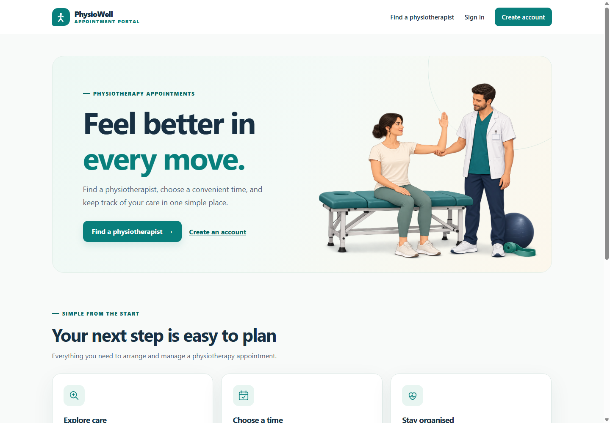
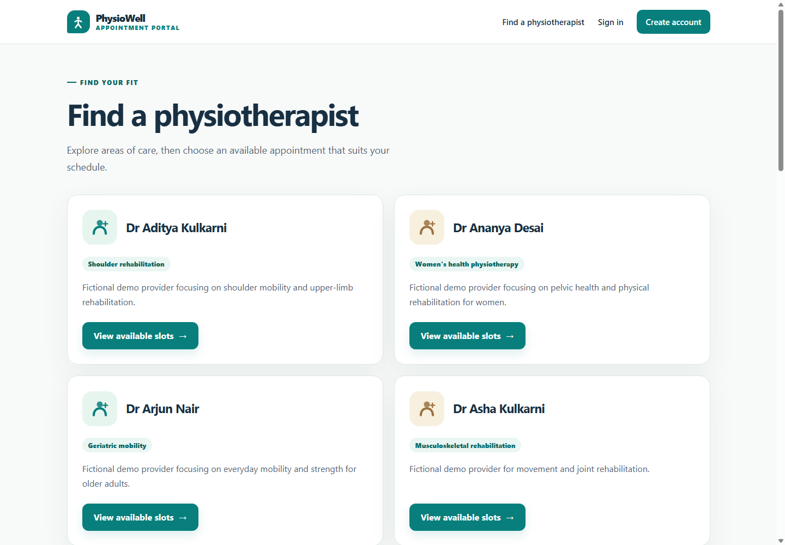

# Physiotherapy Appointment Portal

**DevOps project:** Selenium Testing for a Physiotherapy Appointment Portal

**Student/contributor:** Kirti Vispute (23102C0078)

A patient portal for finding a physiotherapist, choosing an available session, booking it, checking status, and cancelling an eligible appointment. It also demonstrates planning, Git collaboration, Jenkins CI/CD, automated testing, Docker, Ansible, health checks and recovery.

**Latest version:** use [`develop`](https://github.com/kirti-vispute/physiotherapy-appointment-portal/tree/develop) for the current website and documentation. GitHub's default `main` view and the immutable [v1.0.0 release](https://github.com/kirti-vispute/physiotherapy-appointment-portal/releases/tag/v1.0.0) preserve the earlier Task 6 release baseline.

**Latest application verification, 5 October 2026:** manually triggered [Pipeline #23](docs/evidence/Seed_expansion_pipeline23.json) passed **34 backend + 5 Selenium tests** and deployed the update. The [independent live check](docs/evidence/Seed_expansion_live.json) confirmed **15 fictional physiotherapists**, 90 available slots at that time, matching source/image labels, and health `UP` at [127.0.0.1:8087](http://127.0.0.1:8087/). Local services may need restarting after reboot. The earlier [SCM-triggered build #11](docs/evidence/T15_auto_build11.json) proves automatic delivery after a `develop` change.

## Features and scope

| Feature | Implementation |
|---|---|
| Accounts | Registration, validation, unique email, salted password hashes, sign-in/out, session rotation and CSRF |
| Directory | 15 fictional providers with varied specialties; original provider IDs preserved |
| Availability | Future unbooked slots displayed in IST; six 45-minute slots per provider across the next three days on startup |
| Appointments | Booking, confirmation, own status/list, cancellation before start and released availability |
| Protection | Owner-only records, concurrent booking protection, friendly validation/conflict errors |
| Interface | Responsive navy/teal theme, local clinical illustration, provider and appointment cards |
| Delivery | Backend/browser gates, versioned images, local registry, persistent volumes and health checks |

A fresh database has 90 seeded slots. Existing appointments, occupied slots and older history are retained; availability depends on bookings and the current time. Startup adds the next three days without duplicating an existing provider/start-time pair. Clean checkouts contain no patient accounts; register a fictional account. See [seed data](docs/seed-data.md).

The [approved scope](docs/problem-definition.md) excludes payments, medical records, clinician accounts and a complex administration dashboard. All T1–T15 tasks have evidence in the [tracker](docs/project-tracker.md) and [final audit](docs/final-audit.md).

## Quick start

**Prerequisites:** Git, JDK 21 and Maven 3.6.3 or later. These commands use PowerShell. Clone from a folder where you want the project:

```powershell
git clone --branch develop https://github.com/kirti-vispute/physiotherapy-appointment-portal.git
Set-Location -LiteralPath 'physiotherapy-appointment-portal'
mvn -B -ntp clean package
$env:PORT='8083'
java -jar target/physio-portal-1.0.0.jar
```

Expected: 34 backend tests pass, `BUILD SUCCESS` and startup on 8083. Keep this terminal open and visit [localhost:8083](http://localhost:8083/). Register, sign in, book a future free session, inspect status and cancel. Press `Ctrl+C` to stop the manual app. A fresh clone is independent of the existing Jenkins deployment on 8087.

In a second PowerShell terminal, from any folder:

```powershell
Invoke-WebRequest -Uri 'http://localhost:8083/' -UseBasicParsing | Select-Object StatusCode
Invoke-RestMethod -Uri 'http://localhost:8083/actuator/health'
```

Expected: HTTP 200 and `status: UP`. Check `PATH` if Java/Maven is missing, Maven Central access if dependencies cannot download, or choose a free `PORT` if occupied. Full setup, ports, restart steps and deployment prerequisites are in the [local setup guide](docs/local-setup.md).

## Configuration and persistence

| Variable | Default | Purpose |
|---|---|---|
| `PORT` | `8080` | Application HTTP port; quick start overrides to 8083 |
| `DB_URL` | `jdbc:h2:file:./data/physio;DB_CLOSE_ON_EXIT=FALSE` | Persistent database relative to the application's working directory |
| `DEMO_SEED_ENABLED` | `true` | Add fictional providers and upcoming slots; set `false` to disable |

The manual app retains `data/physio.mv.db`. Docker uses a named volume for `/app/data`; Jenkins test uses `physio-portal-cd-test-data`. Keep the same database path/volume on restart. Databases, build output and `.env` files are excluded from Git. Mutations require CSRF; the [API contract](docs/api-documentation.md) covers cookies, tokens, routes, response fields and errors.

## Testing

At the project root, run the backend tests:

```powershell
mvn -B -ntp clean verify
```

Expected: 34 passes, zero failures/errors/skips and `BUILD SUCCESS`. Tests use isolated H2 memory databases and a fixed clock for appointment boundaries. Results: `target/surefire-reports`.

For the five browser journeys, install Chrome and allow Selenium Manager's first driver download. First build and start the manual app as above. In a second terminal at the project root, run browser tests without repackaging the JAR that is running:

```powershell
mvn -B -ntp -Pselenium '-Dselenium.baseUrl=http://localhost:8083' test-compile failsafe:integration-test failsafe:verify
mvn -B -ntp -Pselenium surefire-report:failsafe-report-only
```

Expected: five browser passes and `target/selenium-report/selenium.html`. Journeys cover registration, available slots, booking, cancellation and status. They use unique fictional accounts and cancel confirmed fixture bookings during teardown; accounts and cancelled history remain. Dr Asha Kulkarni must have a future free slot. The profile's legacy default is 8082, so explicitly supply your running application's URL. See the [test plan](docs/selenium-test-plan.md) and [saved report](docs/evidence/T09_report/selenium.html).

Jenkins runs all 39 tests against a temporary app on 8091 and blocks Docker deployment when a gate fails. [Task 10](docs/task-10-continuous-testing.md) preserves the deliberate failure and correction; [seed expansion](docs/seed-data.md) records the longer-directory scrolling fix and build #23 success.

## Architecture and technology

```text
Browser (Thymeleaf) → Spring MVC / REST → services → JPA repositories → H2
GitHub develop → Jenkins → Maven/JUnit → Selenium → Docker image
              → local registry → container replacement → health check
Ansible → separate Ubuntu WSL Docker Engine → pinned demonstration image
```

| Area | Technology |
|---|---|
| Application | Java 21, Spring Boot 4.0.8, embedded Tomcat 11, Thymeleaf |
| Security/data | Spring Security, Spring Data JPA, H2 file database |
| Build/tests | Maven, JUnit, Selenium 4.49.0, Chrome |
| CI/CD | Git/GitHub, local Jenkins 2.568.1, PowerShell |
| Containers | Docker Desktop Linux engine, loopback registry on 5000 |
| Configuration | Ansible on Ubuntu 24.04 WSL with its own Docker Engine |

See the [SRS](docs/srs.md), [architecture/data model](docs/architecture.md) and [seven diagrams](docs/final-diagrams.md). No separate Tomcat or Nginx installation is needed. Images and fonts are local. The documented demonstration uses free tools and local services, with no paid cloud deployment.

## Jenkins and deployment

[Jenkins on localhost:8080](http://localhost:8080/) requires the existing operator account. `physio-portal-ci` builds/tests/packages `develop`; `physio-portal-pipeline` reads the committed [Jenkinsfile](Jenkinsfile). Both poll SCM (`H/2 * * * *`). The Windows Pipeline agent uses tools `JDK21` and `Maven3`, installed Chrome, a running Docker Desktop engine and local registry.

Current stages:

```text
Checkout → Build → Unit Test → Package → Start Application
→ Selenium Tests → Publish Test Report → Docker Build → Docker Tag
→ Docker Push → Stop Previous Container → Run New Container → Health Check
```

Parameters: `APP_ENV=test/demo`, `DOCKER_PORT=8087/8088`; defaults: `test`/8087. Images include version, build and commit identifiers. Test container `physio-portal-cd-test` maps `127.0.0.1:8087` to container port 8080. Windows scripts contain installation paths specific to the demonstrated computer; a fresh machine needs the [deployment prerequisites](docs/local-setup.md#jenkins-and-docker-prerequisites).

[Task 7](docs/task-07-jenkins-ci.md) records initial CI; [Task 8](docs/task-08-pipeline-deployment.md) records the original five-stage JAR pipeline; [Task 10](docs/task-10-continuous-testing.md) adds the browser gate; [Task 12](docs/task-12-docker-cd.md) adds Docker CD. These are dated records of successive versions.

Ansible deploys the pinned build #9 image to a **separate Ubuntu engine** on 8089. That reliability demonstration does not track the latest UI or seed changes. Its first full run changed four tasks; the repeat changed zero. A bad port failed health, and reapplying good settings recovered the container while retaining its volume. See [Ansible setup](ansible/README.md) and [Task 14 recovery](docs/task-14-provisioning.md).

## Repository layout

```text
.github/                  Issue and pull-request templates
docs/                     Requirements, guides, final report and saved evidence
screenshots/              Actual task and interface screenshots
src/main/java/            Controllers, services, entities, repositories and seeds
src/main/resources/       Settings, Thymeleaf pages, CSS and local images
src/test/java/            Backend integration and browser tests
src/test/resources/       Fictional browser fixture
scripts/                  Deployment, browser-test and WSL helpers
ansible/                  Inventory, variables, templates and playbooks
pom.xml                   Build and opt-in Selenium profile
Jenkinsfile                Current CI/CD pipeline
Dockerfile                Java 21 application image
.gitignore                Local data, build output and environment exclusions
```

## Documentation and evidence

Start with the [documentation index](docs/README.md) for all guides and T1–T15 records.

| Need | Document |
|---|---|
| Planning | [Scope](docs/problem-definition.md), [stories](docs/user-stories.md), [backlog](docs/backlog.md), [agile plan](docs/agile-plan.md) |
| Setup/troubleshooting | [Local setup](docs/local-setup.md) |
| API/authentication | [API contract](docs/api-documentation.md) |
| Current interface/doctors | [UI notes](docs/ui-refresh.md), [seed directory](docs/seed-data.md) |
| Completion/evidence | [Tracker](docs/project-tracker.md), [audit](docs/final-audit.md), [evidence index](docs/final-evidence-index.md) |
| Submission/viva | [38-topic report](docs/final-report.md), [16-part demo](docs/final-demo.md) |





Screenshots are dated evidence. [UI notes](docs/ui-refresh.md) record successive image corrections and viewport checks; [seed notes](docs/seed-data.md) record the subsequent 15-provider directory. The [evidence index](docs/final-evidence-index.md) retains all original task screenshots/logs.

## Contribution workflow

Branch from `develop` using `feature/<short-name>` or `codex/<short-name>`, make focused commits, record actual checks, open a PR into `develop`, review/merge and synchronize locally. See [Git workflow](docs/git-workflow.md). Recorded reviews are single-contributor COMMENT self-reviews; independent approval is not claimed. Never force-push or commit credentials, databases or real patient data. Release promotion to `main` is a separate milestone.

**Contributor:** Kirti Vispute, project owner, roll number 23102C0078.
