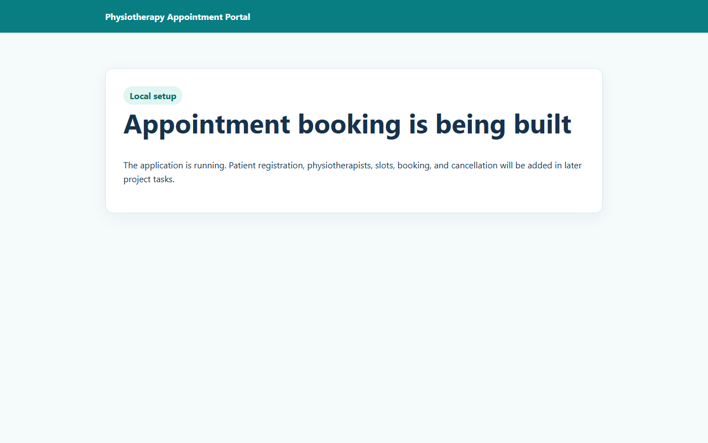
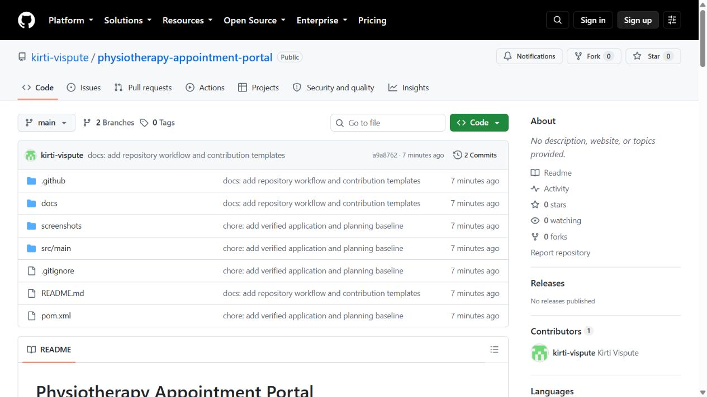
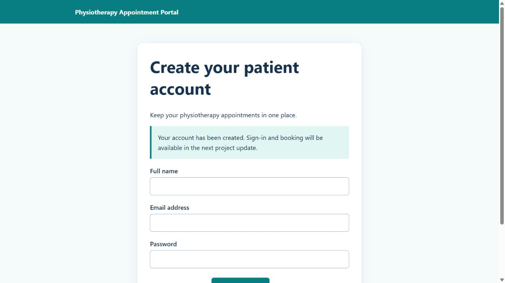
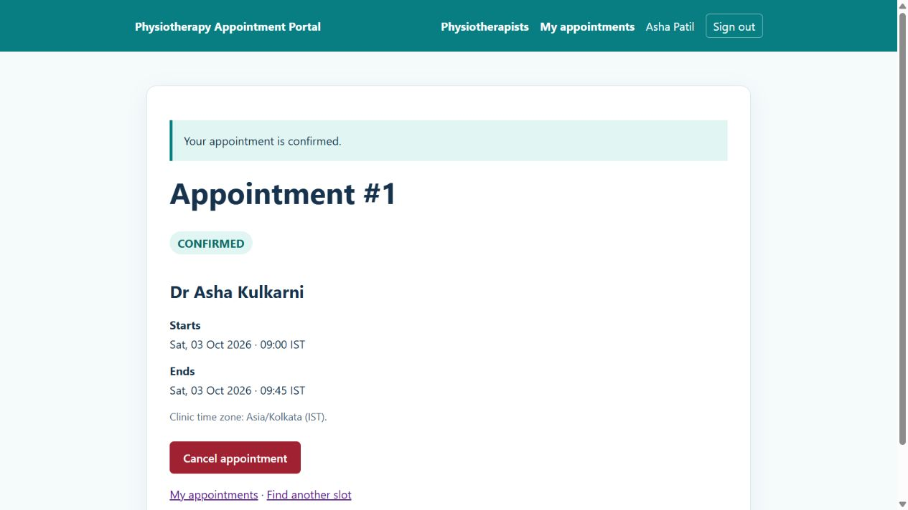
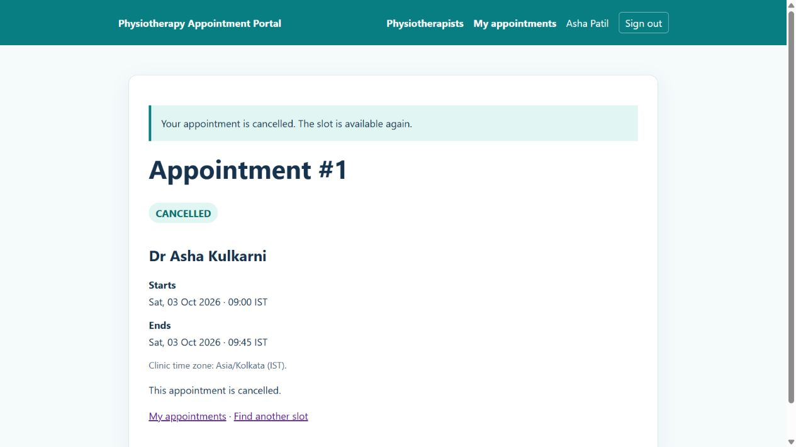
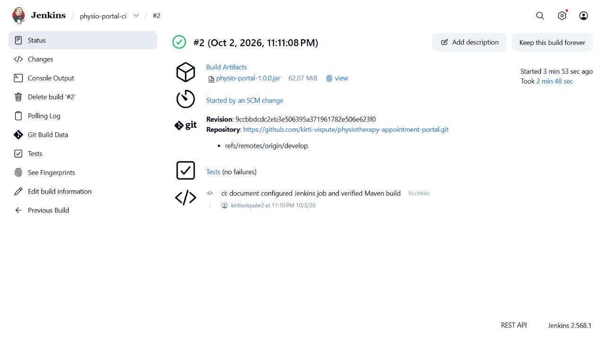
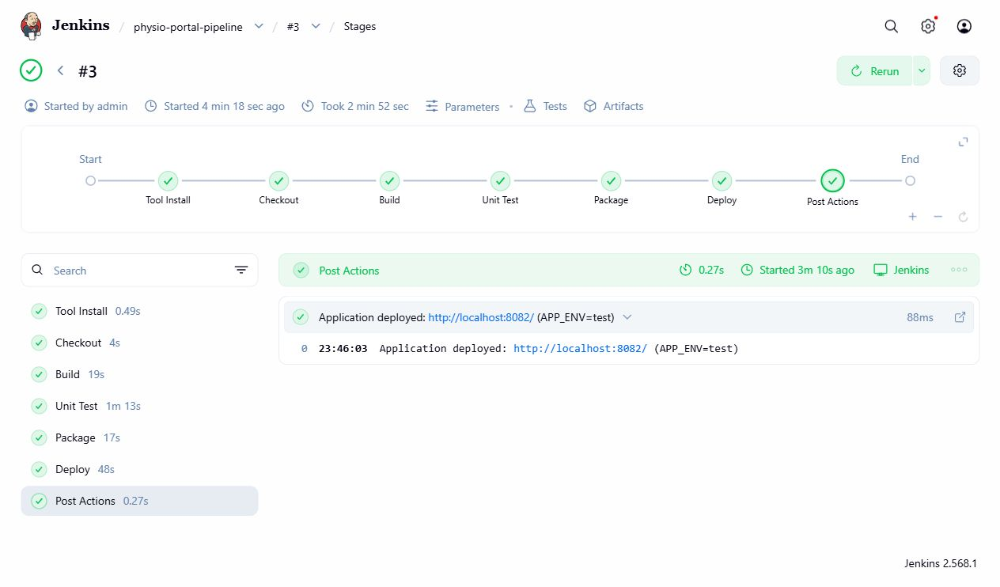
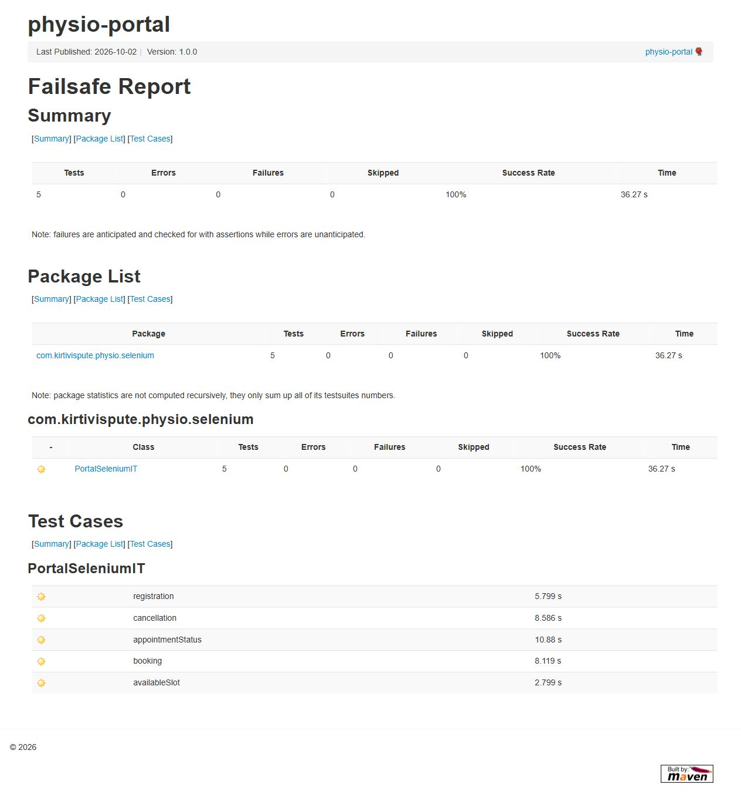
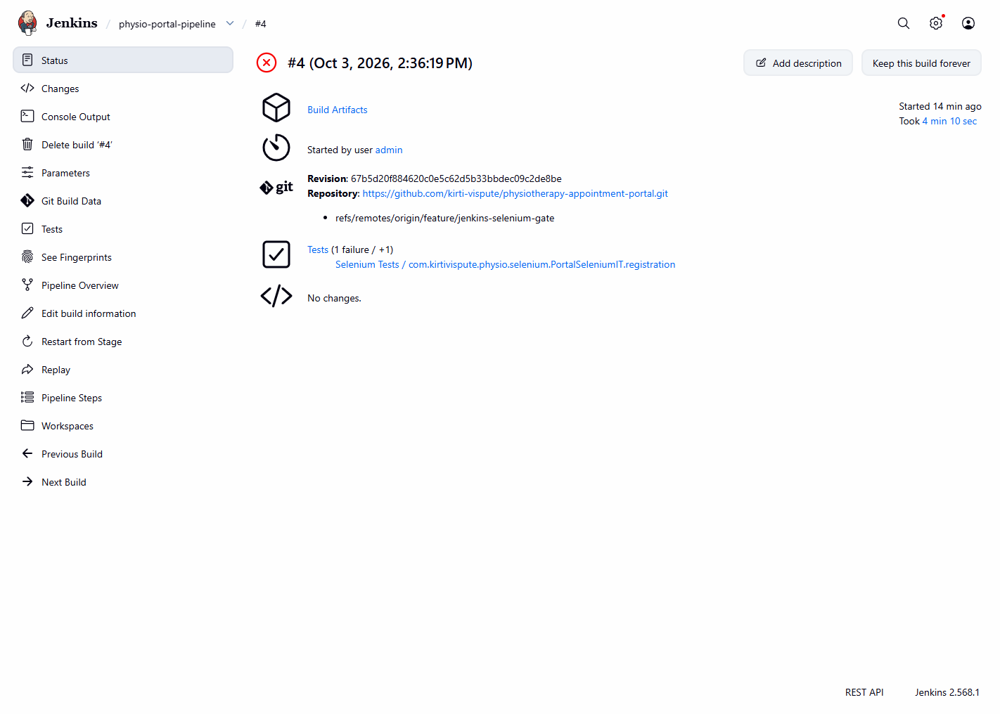
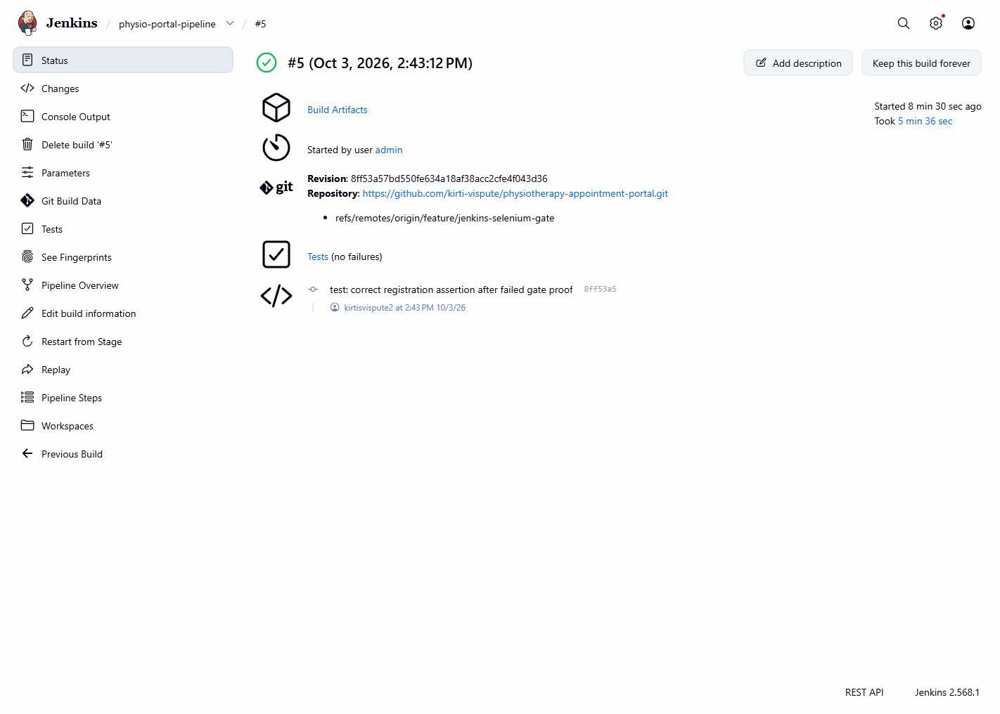

# Physiotherapy Appointment Portal

**DevOps project:** Selenium Testing for a Physiotherapy Appointment Portal  
**Student/contributor:** Kirti Vispute (23102C0078)

## Project at a glance

A small clinic can lose track of appointment requests made by phone or message. This project proposes a patient portal for finding a physiotherapist, choosing a free slot, booking it, checking confirmation/status, and cancelling an eligible booking. It also demonstrates planning, Git collaboration, Jenkins CI, Selenium testing, Docker deployment, Ansible configuration, health checks, and rollback.

**Current verified state:** Tasks 1–10 are complete. The patient MVP works through the browser/API with 34 passing integration tests. Git history includes reviewed PRs, a real conflict and the [v1.0.0 MVP release](https://github.com/kirti-vispute/physiotherapy-appointment-portal/releases/tag/v1.0.0). Jenkins CI checkout/tests/archive and an actual SCM trigger are verified. The versioned pipeline's [build #4](http://localhost:8080/job/physio-portal-pipeline/4/) deliberately failed one Selenium assertion and skipped deployment; [build #5](http://localhost:8080/job/physio-portal-pipeline/5/) passed all **39 tests** and deployed after the correction. Final merged `develop` build #6 also passed and serves the healthy portal at **[localhost:8082](http://localhost:8082/)** using `APP_ENV=test`, `PORT=8082`. Docker and Ansible remain for later tasks. See the [project tracker](docs/project-tracker.md).

## MVP features

| Feature | Current state |
|---|---|
| Homepage and health check | Verified locally in Task 3 |
| Patient registration | Verified UI/API in Task 5; salted password hashes, validation, and duplicate-email protection |
| Patient sign-in/out | Verified sessions, rotation, CSRF, and logout in Task 6 |
| Physiotherapist and open-slot views | Two fictional providers; future available slots displayed in IST |
| Booking, confirmation, status, cancellation | Verified through UI/API with owner-only access and cancellation before start |
| Validation and duplicate-booking protection | 34 passing tests include concurrent booking, ownership, invalid/stale data, repeat cancellation, CSRF |

The [approved scope](docs/problem-definition.md) excludes payments, medical records, clinician accounts, and a complex administration dashboard.

## Architecture and stack

```text
Browser (Thymeleaf pages)
  → Spring MVC controllers and REST API
  → application services and JPA repositories
  → H2 file database

GitHub → Jenkins → Maven/JUnit → Selenium → versioned Docker image
         → registry → container → health check / rollback
Ansible configures the documented Linux target.
```

The app uses Java 21, Spring Boot 4.0.8, Maven, Thymeleaf, H2, and embedded Tomcat. Delivery uses Git/GitHub, Jenkins, Selenium, Docker Desktop, and Ansible from WSL Ubuntu. The detailed [SRS](docs/srs.md), [architecture diagrams and data model](docs/architecture.md), and [API contract](docs/api-documentation.md) distinguish implemented routes from planned ones. No external Tomcat or Nginx instance is required.

## Repository layout

```text
.github/                  Issue and pull-request templates
docs/                     Scope, planning, architecture, API, setup, tracker
screenshots/              Real demonstration images
src/main/java/            Spring Boot application source
src/main/resources/       Configuration and Thymeleaf pages
src/test/java/            JUnit integration and Selenium browser tests
src/test/resources/       Fictional Selenium fixture
pom.xml                   Maven build definition
Jenkinsfile               Parameterized build/test/package/deploy pipeline
scripts/deploy-local.ps1   Owned local Windows demo deployment
.gitignore                Local/build files excluded from Git
```

`Dockerfile` and `ansible/` will be added in their assigned tasks. Empty placeholder files are not used as proof of implementation.

## Local setup and running

**Terminal:** PowerShell on Windows 11. **Location:** Project root. Java 21 and Maven 3.6.3+ are required. The exact path, commands, expected outputs, and troubleshooting notes are in the [local setup guide](docs/local-setup.md).

```powershell
mvn clean package
$env:PORT='8083'
java -jar target/physio-portal-1.0.0.jar
```

The build creates the `1.0.0` executable JAR; the second command chooses port 8083 because Jenkins uses 8080 and Task 8 deployments use 8081/8082; the third starts a separate manual app. Expected: Maven `BUILD SUCCESS` and Spring Boot startup on 8083. Open `http://localhost:8083/`, register a fictional account, sign in, and book a slot. If Maven cannot download dependencies, check Maven Central connectivity. If the port is occupied, choose another free `PORT` in the same terminal. Press `Ctrl+C` to stop this manual app. The live Task 8 portal is already available at [localhost:8082](http://localhost:8082/) without starting a manual copy.

The H2 file `data/physio.mv.db` retains patient/appointment data across restarts. `DEMO_SEED_ENABLED` defaults to `true`: startup seeds two fictional providers and 12 slots across the next three days, preserving existing availability. An unbooked slot must start in the future to appear. Set `$env:DEMO_SEED_ENABLED='false'` to disable seeding. Clean checkouts contain no patient accounts or passwords; create one through the UI. All mutation routes require CSRF; API session/token instructions are in the [API guide](docs/api-documentation.md).

In a **second PowerShell terminal, from any location**, run:

```powershell
Invoke-WebRequest -Uri 'http://localhost:8083/' -UseBasicParsing | Select-Object StatusCode
Invoke-RestMethod -Uri 'http://localhost:8083/actuator/health'
```

These check the manually started homepage and health. Expected: HTTP 200 and `status: UP`. If the connection is refused, check that the manual application is running and the port matches. Task 3 historically verified these endpoints on 8081; Task 8 verified and retained the Jenkins deployment on 8082.

## Testing

**Terminal:** PowerShell at the project root. Run `mvn clean verify` to execute JUnit integration tests and package the app. Expected: `Tests run: 34, Failures: 0, Errors: 0, Skipped: 0` and `BUILD SUCCESS`. This result was observed in Task 6: 14 registration cases and 20 appointment/security cases. Tests use isolated H2 memory databases and a fixed clock for appointment time boundaries; the running app uses `data/physio.mv.db`. If a test fails, inspect `target/surefire-reports` before committing. See the [MVP implementation, Git conflict, and release guide](docs/task-06-mvp.md).

**Task 9 verified:** Selenium 4.49.0 uses real Chrome WebDriver, explicit waits and assertions for registration, open-slot view, booking, cancellation and status. The initial run passed **34 backend + 5 browser tests**; a focused repeat passed **5/5**. An isolated intentional failure produced a screenshot and Maven exit 1. Each booking fixture is cancelled through the UI during teardown.

[PR #4](https://github.com/kirti-vispute/physiotherapy-appointment-portal/pull/4) was self-reviewed with a COMMENT review and merged into `develop`.

```powershell
mvn -B -ntp -Pselenium '-Dselenium.baseUrl=http://localhost:8082' verify
```

Expected: 34 Surefire and five Failsafe cases pass, followed by BUILD SUCCESS. The app must be running with a future free fixture slot. Default `mvn test` continues to run only backend tests; the Selenium profile is opt-in. See the [five-case test plan](docs/selenium-test-plan.md), [execution guide](docs/task-09-selenium.md), [preserved HTML report](docs/evidence/T09_report/selenium.html), or [local report preview](http://localhost:8084/selenium.html). Task 10 added the verified Jenkins browser deployment gate; see the [continuous testing guide](docs/task-10-continuous-testing.md).

## Git and collaboration

The [Git workflow](docs/git-workflow.md) defines `main`, `develop`, and `feature/<short-name>`, meaningful commit messages, PR review, conflict demonstration, and tagging. Both baseline branches have been pushed and verified. Never force-push or commit credentials or the H2 data directory.

**GitHub repository URL:** [kirti-vispute/physiotherapy-appointment-portal](https://github.com/kirti-vispute/physiotherapy-appointment-portal)

## Jenkins CI and pipeline

**Task 7 verified:** Jenkins 2.568.1 runs locally at `http://localhost:8080/`. The freestyle job [physio-portal-ci](http://localhost:8080/job/physio-portal-ci/) checks out public GitHub `develop`, runs `mvn clean test` then `mvn package`, publishes 34 JUnit tests, and archives/fingerprints `physio-portal-1.0.0.jar`. Manual build #1 and automatic SCM-triggered build #2 both succeeded. Poll SCM uses `H/2 * * * *`, avoiding a public webhook tunnel. The [Jenkins guide](docs/task-07-jenkins-ci.md) records exact tools/plugins/settings, commands, build/trigger evidence, and installation limitations. The existing unrelated Jenkins job was preserved.

**Task 8 verified:** [Jenkinsfile](Jenkinsfile) runs Checkout → Build → Unit Test → Package → Deploy. [PR #3](https://github.com/kirti-vispute/physiotherapy-appointment-portal/pull/3) was self-reviewed and merged into `develop`. Corrected pipeline #2 (`demo`/8081) and final #3 (`test`/8082) passed all 34 tests, archived the JAR/logs/metadata, and deployed with embedded Tomcat. The [live portal](http://localhost:8082/) returned HTTP 200 and health UP after build completion; archived/live JAR hashes match. The initial Windows wrapper hang, correction, exact commands/configuration, parameters and evidence are in the [Task 8 guide](docs/task-08-pipeline-deployment.md). Both demo processes remain running; redeploy after reboot. Task 9 local Selenium execution and Task 10 Jenkins integration/deployment gating are verified.

**Task 10 verified:** [PR #5](https://github.com/kirti-vispute/physiotherapy-appointment-portal/pull/5) added Start Application → Selenium Tests → Publish Test Report before Deploy. Jenkins [failure #4](http://localhost:8080/job/physio-portal-pipeline/4/) ran a deliberately wrong assertion, archived its browser report/screenshot and skipped deployment; the existing portal stayed healthy. Correction [build #5](http://localhost:8080/job/physio-portal-pipeline/5/) passed 34 backend plus five browser tests and deployed successfully. Final `develop` build #6 confirmed the merged gate. The [Task 10 guide](docs/task-10-continuous-testing.md) has the exact commits, commands, results and screenshots.

## Docker deployment

**Planned for Tasks 11–12; no image or container exists yet.** A root `Dockerfile` will package the executable JAR. The image will receive a versioned tag, be pushed to a registry, and be deployed by Jenkins only after tests pass. The container will map a host port to its application port and mount a persistent H2 data location. Lifecycle commands, IDs, logs, and health results will be added to `docs/docker.md` when actually run.

## Ansible configuration and reliability

**Planned for Tasks 13–14; no playbook has run yet.** Ansible from WSL Ubuntu will configure the documented Linux target, application folders/files, and container deployment, then verify health. A second run will demonstrate idempotency. A bad-release simulation and rollback to a known good version will be documented with actual logs. Docker Desktop on Windows is a host prerequisite, not something the Linux playbook claims to install. Exact commands will live in `ansible/README.md` after the playbook exists.

## Project workflow and evidence

Requirements → planning → architecture → feature branches/PRs → Maven/Jenkins → Selenium gate → Docker image/registry → deployment → Ansible configuration → health check → feedback/rollback. The [agile plan](docs/agile-plan.md) has the lifecycle diagram, backlog, sprints, and Definition of Done. The [tracker](docs/project-tracker.md) records the status and evidence for all 15 tasks.

### Screenshots





Task 4 also includes [branch evidence](screenshots/T04_branches.jpg) and [initial commit evidence](screenshots/T04_commits.jpg). These capture the initial publication before the subsequent evidence documentation commit.

Additional images will be added only after the corresponding GitHub, Jenkins, Selenium, Docker, or Ansible step has actually been demonstrated. The screenshot checklist and final audit will link to them.



[Task 5 duplicate-email message](screenshots/T05_registration_duplicate.jpg)

Task 5 GitHub evidence: [pull request](screenshots/T05_pull_request.jpg), [self-review](screenshots/T05_review.jpg), and [merged PR](screenshots/T05_merge.jpg). Commands, test results, actual SHAs, and screenshot instructions are in the [Task 5 guide](docs/task-05-registration.md).





Task 6 also records [providers](screenshots/T06_physiotherapists.jpg), [slots](screenshots/T06_available_slots.jpg), [own appointment status](screenshots/T06_appointment_status.jpg), [released slot](screenshots/T06_slot_released.jpg), [sign-out](screenshots/T06_sign_out.jpg), [merged PR](screenshots/T06_merge.jpg), [self-review](screenshots/T06_review.jpg), and [release tag](screenshots/T06_release_tag.jpg). The [Task 6 guide](docs/task-06-mvp.md) links the real Git conflict, test results, and release evidence. The verification app was stopped after the restart check.



Task 7 also records [34 passing Jenkins tests](screenshots/T07_test_results.jpg), [artifact fingerprint](screenshots/T07_artifact.jpg), [polling change detection](screenshots/T07_polling.jpg), [configured tools](screenshots/T07_tools.jpg), and actual console/API evidence in the [Task 7 guide](docs/task-07-jenkins-ci.md).



Task 8 also records [actual parameters](screenshots/T08_parameters.jpg), [SCM configuration](screenshots/T08_job_config.jpg), [successful final build](screenshots/T08_pipeline_success.jpg), [deployed home](screenshots/T08_deployed_application.jpg), and [deployed providers](screenshots/T08_deployed_providers.jpg).



Task 9 also preserves the five [journey screenshots](docs/task-09-selenium.md), [failure capture](screenshots/T09_failure_capture.png), XML results and actual execution logs.





## Contributors

- **Kirti Vispute**, student and project owner, roll number 23102C0078.
