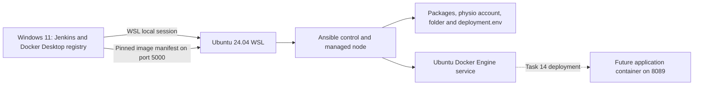
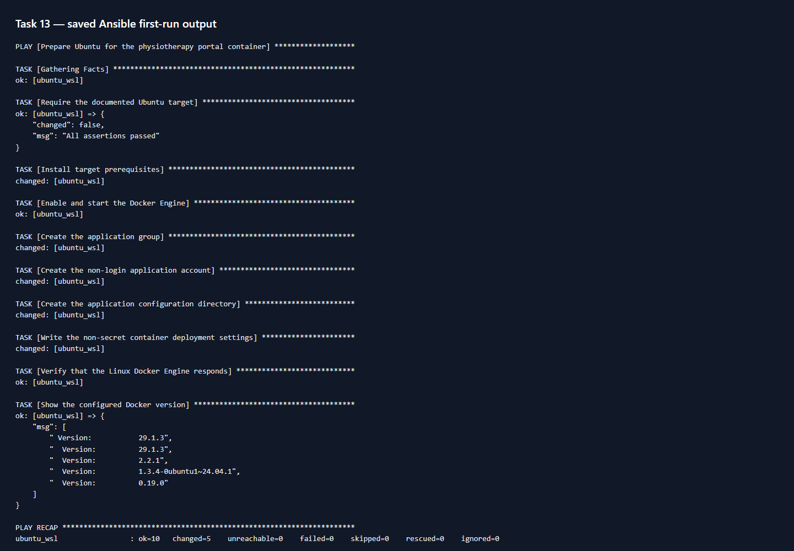

# Task 13 — Ansible configuration management

**Owner:** Kirti Vispute (23102C0078)

**Date:** 3 October 2026
**Status:** ✅ First configuration run verified; deployment and second run are Task 14

[PR #8](https://github.com/kirti-vispute/physiotherapy-appointment-portal/pull/8) received an honest [COMMENT self-review](https://github.com/kirti-vispute/physiotherapy-appointment-portal/pull/8#pullrequestreview-5401355533) and was merged into `develop` at `4f1c1858bd61e397ba005634136c08295b0d6634`. This is a single-contributor review, not independent approval. The merged playbook blob matches the tested feature version.

## Objective and target

Ansible prepares Ubuntu 24.04 in WSL for the physiotherapy portal container. This Ubuntu distribution is both the Ansible control node and the managed node, using a local connection. It has its own Linux Docker Engine, separate from the Docker Desktop engine that Jenkins uses on Windows. Task 13 configures the machine and application settings. Task 14 will deploy a container, repeat the playbook, check health, and demonstrate recovery.

## Configuration specification

| Item | Required state | Verified Task 13 state |
|---|---|---|
| Target | Ubuntu 24.04 WSL, Python 3, systemd | Ubuntu 24.04.5; systemd running |
| Packages | `ca-certificates`, `curl`, `docker.io`, `git`, `python3` | Installed or confirmed by Ansible |
| Java and Maven | Jenkins builds the JAR; Java 21 is in the application image | No host Java/Maven installation needed on this container target |
| Ansible | Linux control tool | Ansible 9.2.0 / core 2.16.3 installed in Ubuntu |
| Service user | `physio`, UID/GID 10001, no login shell | Created; `id physio` verified |
| Folder | `/opt/physio-portal`, owner `physio:physio`, mode `0750` | Created with those permissions |
| Environment file | `/opt/physio-portal/deployment.env`, `root:physio`, mode `0640` | Rendered with no secrets and verified |
| Docker configuration | Pinned image, container name, volume, environment, bind address and ports | Set in the Ansible variables and environment template; no Docker Desktop daemon settings changed |
| Docker service | Ubuntu `docker.service` enabled and running | `enabled`, `active`; server version 29.1.3 |
| Application container | `physio-portal-ansible` on the Ubuntu engine | Planned for Task 14; not started in Task 13 |
| Ports | Registry `127.0.0.1:5000`; future app `127.0.0.1:8089` → container `8080` | Registry HTTP 200 and pinned manifest verified; app port reserved |

Ansible uses `root` for local lab package and system configuration. The non-login `physio` account matches the Docker image's runtime UID 10001 and is not added to the host Docker group. The H2 data will use named volume `physio-portal-ansible-data` when Task 14 deploys the container. The environment file pins image `localhost:5000/physio-portal:1.0.0-b9-180b726bc020` and contains no credentials or patient data.

## Files and task explanations

| File or playbook task | What it does |
|---|---|
| [inventory.ini](inventory.ini) | Names the Ubuntu WSL target and selects the local Python connection. |
| [group_vars/physio_targets.yml](group_vars/physio_targets.yml) | Holds the account, folder, image, port and volume settings. |
| [templates/deployment.env.j2](templates/deployment.env.j2) | Renders the non-secret application/container settings. |
| [playbook.yml](playbook.yml) — Require Ubuntu | Stops before making changes on an unsupported distribution. |
| Install prerequisites | Uses Ubuntu `apt` to ensure packages are present. |
| Enable and start Docker | Uses systemd to keep the Linux Docker Engine available. |
| Create group and account | Creates the fixed non-login application identity. |
| Create configuration directory | Creates `/opt/physio-portal` with restricted ownership and mode. |
| Write deployment settings | Writes the environment file only when its content or permissions differ. |
| Verify and show Docker version | Confirms the daemon responds without recording a change. |

The playbook describes the desired state rather than issuing unconditional shell changes. A second run is reserved for Task 14's idempotency evidence.

## First execution: exact commands and results

**Terminal:** Windows PowerShell at the project root. These setup commands install the Ubuntu distribution and Ansible once. They were run on this Windows 11 host.

```powershell
wsl --install -d Ubuntu-24.04 --no-launch
wsl -d Ubuntu-24.04 -u root -- apt-get update
wsl -d Ubuntu-24.04 -u root -- env DEBIAN_FRONTEND=noninteractive apt-get install -y ansible
```

**Expected:** Ubuntu appears in `wsl --list --verbose`, and Ansible reports a version. **Actual:** Ubuntu 24.04.5 and Ansible core 2.16.3 installed. On a machine without WSL enabled, Windows may require a restart. If `apt` fails, inspect its network or package error before retrying. Docker Desktop's internal `docker-desktop` distribution is not the project target.

**Terminal:** Windows PowerShell at the project root. The Linux path is this workspace mounted in WSL; keep the quotes around paths containing spaces. Syntax check reads the files. The second command actually changes the Ubuntu target.

```powershell
$linuxProject = '/mnt/d/Kirti/__VIT RELATED/Lab Experiments/DEVOPS/DevOps Project'
wsl -d Ubuntu-24.04 -u root -- ansible-playbook --syntax-check -i "$linuxProject/ansible/inventory.ini" "$linuxProject/ansible/playbook.yml"
wsl -d Ubuntu-24.04 -u root -- ansible-playbook -i "$linuxProject/ansible/inventory.ini" "$linuxProject/ansible/playbook.yml"
```

**Expected:** syntax check names `playbook.yml`; the first run ends with `unreachable=0 failed=0`. **Actual:** `ok=10 changed=5 unreachable=0 failed=0`, saved in the [first-run log](../docs/evidence/T13_ansible_first_run.txt). The five changes were packages, group, account, directory and environment file. Docker was already started during package installation, so the systemd task correctly reported `ok`.

**Terminal:** Windows PowerShell at the project root. These read-only commands check Docker, the account, permissions and pinned registry image:

```powershell
wsl -d Ubuntu-24.04 -u root -- systemctl is-active docker
wsl -d Ubuntu-24.04 -u root -- systemctl is-enabled docker
wsl -d Ubuntu-24.04 -u root -- id physio
wsl -d Ubuntu-24.04 -u root -- stat -c '%a %U:%G %n' /opt/physio-portal/deployment.env
wsl -d Ubuntu-24.04 -u root -- docker version --format '{{.Server.Version}}'
wsl -d Ubuntu-24.04 -u root -- docker manifest inspect --insecure localhost:5000/physio-portal:1.0.0-b9-180b726bc020
```

**Expected and actual:** Docker `active`/`enabled`; UID/GID 10001; file `640 root:physio`; Docker server 29.1.3; versioned registry manifest returned. The [independent target check](../docs/evidence/T13_target_state.json) also records registry HTTP 200. The [manifest](../docs/evidence/T13_registry_manifest.json) is saved. `--insecure` is needed because this registry uses HTTP on loopback only. If Docker fails, inspect `systemctl status docker` in Ubuntu. If the manifest fails, check that the Task 12 registry is running and its `/v2/` endpoint is reachable from Ubuntu. Inspecting a manifest does not deploy a container.

## Architecture and screenshot



The solid arrows and configured resources were verified in Task 13. The dotted arrow is planned Task 14 deployment.



**Screenshot required?** Yes, for the project evidence checklist. **What is visible?** The actual first-run task names and `PLAY RECAP` with `ok=10 changed=5 unreachable=0 failed=0`. **Source:** the saved log linked above. The screenshot is a browser rendering of that log for legibility, not a live terminal capture. **Suggested filename used:** `screenshots/T13_ansible_execution.png`. To capture a terminal version, run the playbook command above in a visible PowerShell terminal and include the recap. A later run belongs to Task 14 and its `changed` count may differ.

## Task 13 checklist

- ✅ Packages, users, folders, files, ports and services specified
- ✅ Inventory, variables, template and playbook created
- ✅ Every playbook task explained
- ✅ First execution completed with `failed=0`
- ✅ Execution log, independent checks, registry manifest and screenshot saved
- ⬜ Task 14: second run, container deployment, health check, bad release and rollback
