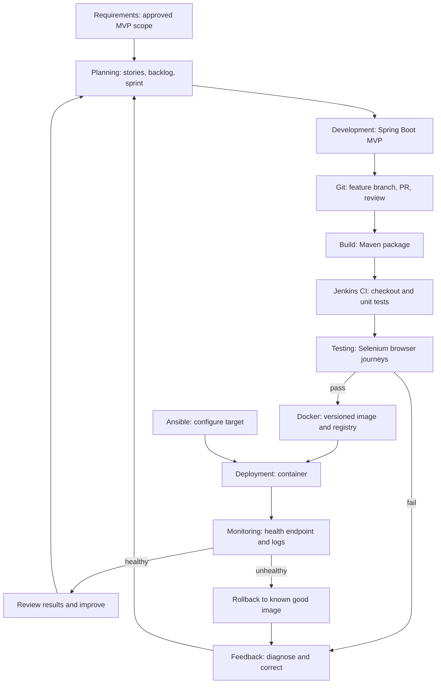

# Task 2 — Agile Plan and DevOps Workflow

**Project:** Selenium Testing for a Physiotherapy Appointment Portal  
**Owner for all tasks:** Kirti Vispute (23102C0078)  
**Updated:** 2 October 2026  
**Method:** A single-owner, sequential Kanban board grouped into short milestone sprints. Status represents verified progress, not elapsed time.

## 15-task Kanban board

All tasks have one owner. `Done` requires the listed acceptance evidence; a document alone does not prove an unrun pipeline or deployment.

| Task | Name | Description | Owner | Status | Dependencies | Deliverable | Acceptance criteria |
|---|---|---|---|---|---|---|---|
| 01 | Problem Definition | Define need and freeze MVP | Kirti | ✅ Done | None | `problem-definition.md` | Every required section present; Kirti explicitly approved scope on 2 Oct 2026 |
| 02 | Agile Planning | Stories, backlog, board, sprints, DoD, workflow | Kirti | ✅ Done | 01 | `user-stories.md`, `backlog.md`, `agile-plan.md` | Every story has priority/criteria/DoD; all 15 tasks appear on board; lifecycle diagram source is present and reviewed |
| 03 | Architecture | SRS, actors, diagrams, entities, APIs, local setup | Kirti | ✅ Done | 02 | SRS and architecture/API documents | MVP requirements trace to design; application built and responded locally on port 8081 |
| 04 | Git/GitHub | Initialize repo and collaboration rules | Kirti | ✅ Done | 03 | Repository, README, templates, branches | Remote URL, initial commits, `main`/`develop`, and evidence verified on GitHub |
| 05 | Feature Development | First feature branch, PR, review, merge | Kirti | ✅ Done | 04 | Registration and PR #1 | 14 tests and UI/API/persistence verified; PR #1 reviewed with COMMENT self-review and merged into `develop` |
| 06 | MVP Collaboration | Complete remaining features and Git exercise | Kirti | ⬜ To do | 05 | Working MVP, second branch, conflict resolution, tag | Core journeys work; actual conflict resolution and `v1.0.0` tag recorded |
| 07 | Jenkins CI | Configure job and repository trigger | Kirti | ⬜ To do | 04, 06 | Jenkins job and archived JAR | Real checkout/build/test/package succeeds; artifact and trigger shown |
| 08 | Jenkins Pipeline | Parameterized stages and JAR deployment | Kirti | ⬜ To do | 07 | `Jenkinsfile`, deployed app | Successful stages, parameter, URL, and logs recorded |
| 09 | Selenium | Design and run five critical browser journeys | Kirti | ⬜ To do | 06 | Test plan, scripts, local report | Five meaningful tests pass locally; screenshot-on-failure works |
| 10 | Continuous Testing | Integrate Selenium and prove deployment gate | Kirti | ⬜ To do | 08, 09 | Failed and corrected Jenkins runs | Failure blocks deploy; correction commit and successful rerun recorded |
| 11 | Docker | Build image and demonstrate container lifecycle | Kirti | ⬜ To do | 06, 10 | Dockerfile, versioned image, command log | Image/container IDs, mapping, logs, start/stop/restart/remove shown |
| 12 | Docker CD | Publish image and deploy automatically | Kirti | ⬜ To do | 10, 11 | Registry image and Jenkins deployment | Versioned push, fresh container, health, and commit-to-container trace shown |
| 13 | Ansible | Specify target and configure it with playbook | Kirti | ⬜ To do | 11, 12 | Inventory, variables, playbook, first log | Tasks explained; actual first execution has `failed=0` |
| 14 | Provisioning/Reliability | Repeat run, health, bad release, rollback | Kirti | ⬜ To do | 13 | Two runs and recovery evidence | Second run avoids unnecessary changes; restored app returns HTTP 200 |
| 15 | Final Validation | Audit deliverables and rehearse viva | Kirti | ⬜ To do | 01–14 | Final report, evidence index, demo sequence | Every line checked; missing evidence is reported, never invented |

## Sprint plan

Sprint boundaries are milestone reviews, not invented calendar dates. A sprint closes only when its listed deliverables are verified.

| Sprint | Goal | Tasks | Review demonstration | Exit condition |
|---|---|---|---|---|
| 0 — Define | Agree on scope and design | 01–03 | Approved scope, stories, diagrams, local start | Design and local setup verified |
| 1 — Build | Create repository and functional MVP | 04–06 | GitHub history, PR, working booking flow, conflict, tag | MVP behavior and Git evidence verified |
| 2 — Test | Add CI, pipeline, and browser gate | 07–10 | Jenkins archive, parameterized deployment, five tests, fail/fix rerun | Failed Selenium run blocks deploy; corrected run succeeds |
| 3 — Deploy | Containerize, publish, provision, recover | 11–14 | Docker lifecycle, registry, Ansible runs, health, rollback | Healthy versioned container and recovery evidenced |
| 4 — Submit | Audit and rehearse | 15 | Final document and live viva sequence | All required rows have evidence or explicit missing status |

## Project-level Definition of Done

For any implementation item:

1. Behavior matches its story acceptance criteria and the frozen scope.
2. Code and configuration are committed on the appropriate branch, reviewed where a PR is required, and contain no credentials or real patient data.
3. Relevant automated tests run and pass; a failure is fixed and rerun rather than hidden.
4. Documentation gives the exact commands, environment, expected output, and known setup constraints.
5. Evidence is saved for any required Git, Jenkins, Selenium, Docker, or Ansible demonstration. Expected output is labeled as expected until actually observed.
6. The backlog, board, tracker, and evidence index reflect the verified state.

For a planning item, implementation tests are not applicable. It is done when all required fields are present, consistent with the approved scope, and reviewed. The overall project is done only after Task 15 confirms all assignment requirements and evidence.

## DevOps lifecycle

The sequence below is the intended workflow. Feedback from tests, health checks, and the viva returns to planning and improvement.

**Diagram components and labels:** Requirements → Planning → Development → Git → Build → Jenkins CI → Testing → Docker → Deployment → Monitoring/Health Check → Feedback → Improvement. The `pass` and `fail` arrows show the test gate; Ansible configures the target before container deployment; an unhealthy deployment follows rollback and feedback.

## Task 2 verification and evidence

- **Screenshot required?** No. The versioned planning documents and rendered Mermaid diagram are the evidence. A screenshot is optional for a presentation.
- **What must be visible?** All 11 stories with priority, criteria, and story DoD; 15 backlog rows; 15 board rows with the required columns; sprint goals and exit conditions; project DoD; lifecycle arrows and feedback loop.
- **Command required?** None for planning. Open the Markdown files in the editor and inspect the rendered diagram. A source-text check can verify row counts, but it does not replace a content review.
- **Actual result:** The documents agree with the approved scope. A source check counted 11 stories, 11 acceptance blocks, 11 story DoD blocks, 15 backlog rows, 15 board rows, five sprint rows, and one Mermaid lifecycle diagram. Its source was reviewed; visual rendering has not been separately tested.
- **Suggested evidence:** `docs/user-stories.md`, `docs/backlog.md`, `docs/agile-plan.md`.
