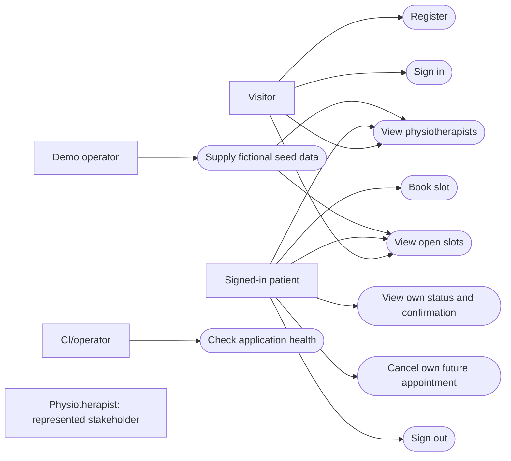
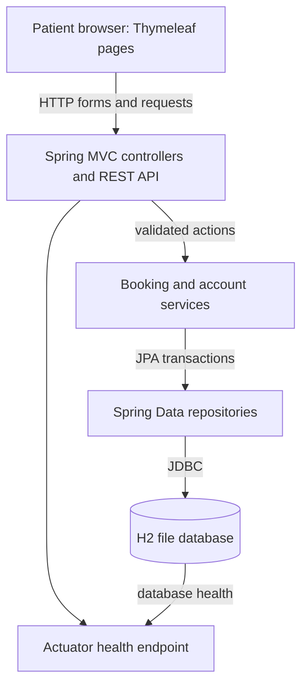
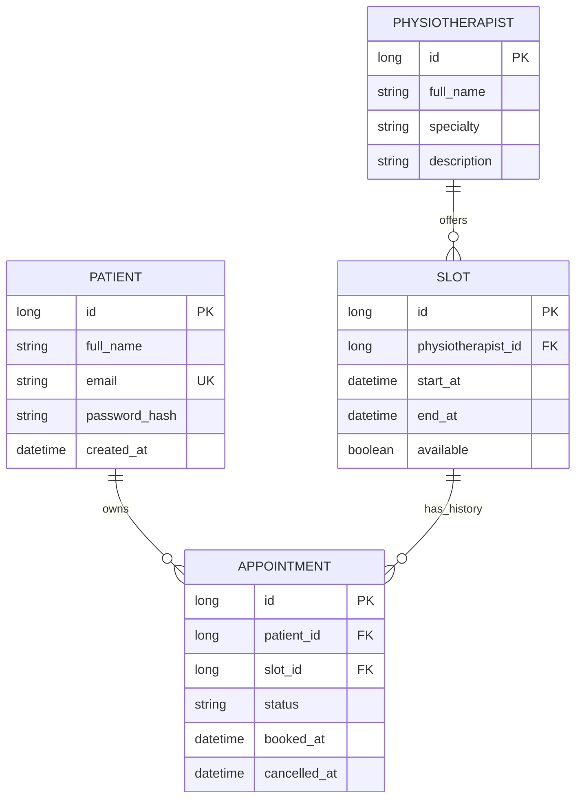

# Task 3 — Architecture and Data Model

**Status:** Application architecture and the delivery path were implemented and verified through Tasks 5–14. The final delivery components and their separate hosts are shown below.

## Technology choices

| Layer | Technology | Purpose |
|---|---|---|
| Browser | Thymeleaf-rendered HTML/CSS, minimal JavaScript | Simple patient pages and stable Selenium selectors |
| Server | Java 21, Spring Boot 4.0.8, embedded Tomcat 11 | HTTP pages, REST endpoints, services, validation |
| Persistence | Spring Data JPA and H2 file database | Small local data set that survives restarts when its path persists |
| Build/test | Maven 3.9.16 available locally, JUnit, Selenium WebDriver | Build, unit and browser test execution |
| Delivery | Git/GitHub, Jenkins, Docker Desktop, Ansible from WSL Ubuntu | Version control, CI/CD, containers, configuration |

Spring Boot 4.0.8 supports Java 21 and Maven 3.9.16. The embedded Tomcat server meets the assignment's application-server requirement. No separate Nginx or Tomcat process is part of this architecture. Version and server details are based on [Spring Boot system requirements](https://docs.spring.io/spring-boot/4.0/system-requirements.html).

## Use-case diagram

Mermaid does not have a native UML use-case shape, so the following flowchart expresses actor-to-use-case links. The physiotherapist is shown as a stakeholder, not as an interactive portal user.

**Actors and labels:** Visitor and patient use the browser; the demo operator supplies seed data outside the patient UI; CI/operator checks health. The physiotherapist has no account or direct use case in this MVP.

## Application architecture

**Connections:** Browser → backend/API → service → repository → H2. The health endpoint checks application/database readiness. Patient pages and JSON APIs use the same service rules. A single Spring Boot JAR includes embedded Tomcat.

## Verified delivery architecture

```mermaid
flowchart LR
    GitHub[GitHub develop branch] -->|Poll SCM and checkout| Jenkins[Jenkins on Windows host]
    Jenkins --> Maven[Maven build and unit tests]
    Maven --> Selenium[Chrome Selenium tests on temporary Windows app]
    Selenium -->|pass only| Image[Docker versioned image]
    Image --> Registry[Local registry on port 5000]
    Registry --> Container[Docker Desktop container on port 8087]
    Registry --> Ubuntu[Separate Ubuntu WSL Docker Engine]
    Ansible[Ansible on Ubuntu WSL] -->|configure and deploy| Ubuntu
    Ubuntu --> Target[Application container on port 8089]
    Container -->|HTTP GET| Health[Actuator health check]
    Target -->|HTTP GET| Health
    Health -->|failure during Task 14 simulation| Rollback[Reapply known good Ansible configuration]
```

**Connections and labels:** GitHub `develop` → Windows Jenkins → Maven/JUnit → Selenium → versioned image → local registry → Docker Desktop deployment on 8087. Separately, Ansible configures Ubuntu WSL and pulls the pinned image into Ubuntu's own Docker Engine on 8089. Task 14's deliberate port mismatch failed Ansible's health gate; rerunning the playbook with versioned good settings recovered the container while retaining its image and data volume. The two Docker Engines are distinct.

## Data model

| Table | Primary key | Attributes and constraints | Foreign keys |
|---|---|---|---|
| `patients` | `id` | `full_name` required; `email` required/unique; `password_hash` required; `created_at` required | — |
| `physiotherapists` | `id` | Required `full_name` (unique seed key), `specialty`, `description` | — |
| `slots` | `id` | Constructor validates `start_at < end_at`; future for bookings; `available` defaults true; database unique provider/start time | `physiotherapist_id → physiotherapists.id` |
| `appointments` | `id` | `status ∈ {CONFIRMED, CANCELLED}`; `booked_at` required; `cancelled_at` for cancellation | `patient_id → patients.id`; `slot_id → slots.id` |

**Relationships:** One patient has many appointments; one physiotherapist offers many slots; one slot can have multiple historical appointments but at most one active `CONFIRMED` appointment through the shared service. Booking locks the slot row in a transaction, checks availability/start time, creates the appointment, and sets `available=false`. Cancellation finds the owner's appointment, locks the same slot, refreshes the appointment after waiting, and then updates status/availability. Already-cancelled records return without changing the slot, including after someone else rebooks it. Concurrent booking/cancellation, ownership, and start-time tests passed in Task 6.

**Time and persistence:** Store instants or UTC timestamps and render them in `Asia/Kolkata`. The local H2 database path defaults to `./data/physio`, relative to the process working directory. Tasks 11–14 mounted `/app/data` in containers so the database survives replacement. Schema changes must remain compatible with the rollback demonstration.

## Security and failure boundaries

- Authentication uses a Spring Security patient session and the existing salted PBKDF2 encoder. Sign-in rotates the session ID/CSRF token; logout invalidates the session. Session cookies are HttpOnly, SameSite=Lax, and never rewritten into URLs. Local HTTP is used for the college demonstration; cookies require Secure when a future deployment uses HTTPS.
- Form and API mutations require CSRF, including registration/login/logout. `/api/auth/csrf` supplies the session's token. Thymeleaf forms insert it automatically. This follows [Spring Security CSRF guidance](https://docs.spring.io/spring-security/reference/servlet/exploits/csrf.html).
- JSON login explicitly invokes session/CSRF strategies and saves the context for subsequent requests, following [Spring Security authentication persistence guidance](https://docs.spring.io/spring-security/reference/servlet/authentication/session-management.html).
- Booking/status APIs derive patient identity from the session; form/API validation rejects malformed values before persistence.
- Missing or foreign appointment identifiers return the same non-revealing `404` response.
- Expected conflicts return clear messages and HTTP `409`; missing/invalid CSRF gives `403` and anonymous protected API access gives `401`.
- `/actuator/health` is the only operational endpoint planned for public health checks; additional actuator details remain restricted.
