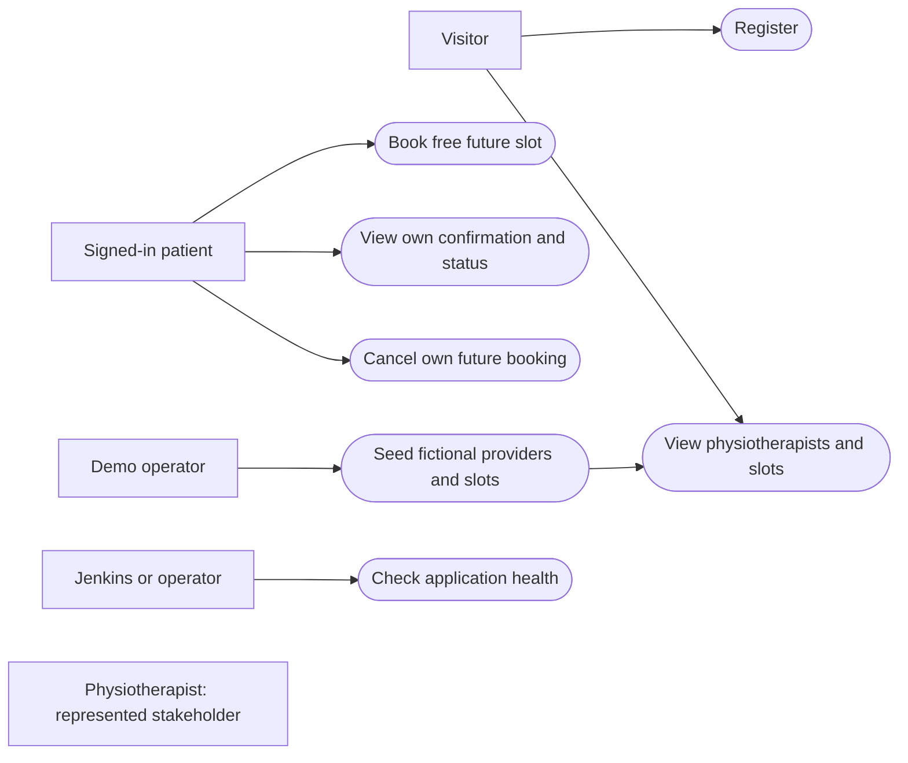
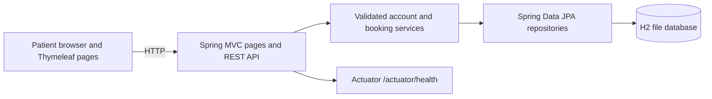
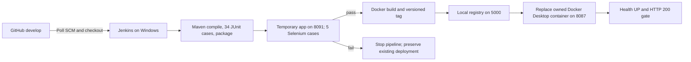
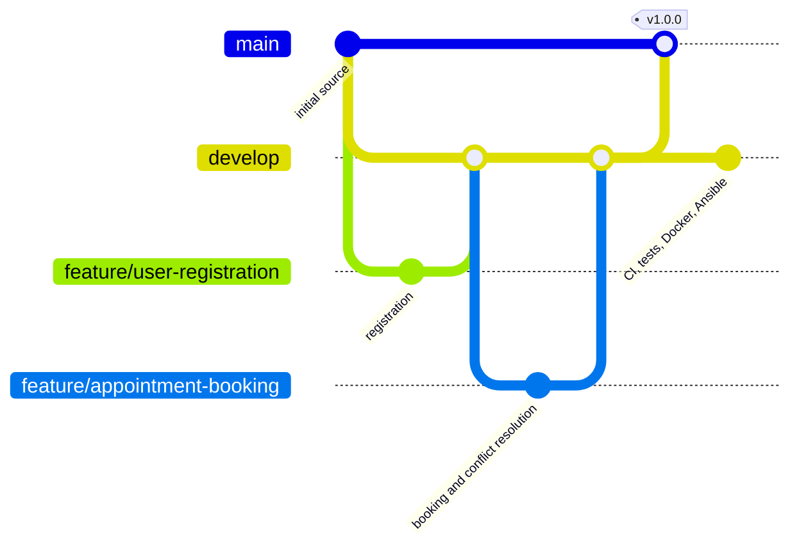
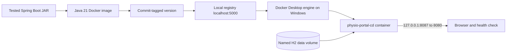
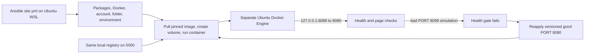
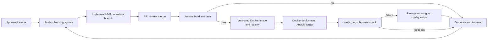

# Final diagrams — verified implementation

Each diagram names the components and labels the actual direction of use. These are source diagrams for the report and viva; the linked task guides contain the command and result evidence. All hosts and ports below are local to Kirti's computer.

## 1. Use cases

The physiotherapist has no interactive account in the frozen MVP. See the [SRS](srs.md) and [application architecture](architecture.md).

## 2. Application architecture

The Spring Boot JAR includes embedded Tomcat; `/app/data` is mounted as a named Docker volume for container deployments. See the [data model](architecture.md#data-model) and [API contract](api-documentation.md).

## 3. CI/CD pipeline

The stages follow the committed [Jenkinsfile](../Jenkinsfile). See [Task 10](task-10-continuous-testing.md) for the deliberately failed test gate and [Task 12](task-12-docker-cd.md) for a successful end-to-end registry deployment.

## 4. Git branching and release

The diagram compresses later feature PRs for readability. [Git workflow](git-workflow.md) names the real branches, PRs, conflict resolution, and release commit; `main` remains the Task 6 baseline while `develop` carries later work.

## 5. Docker deployment

The image tag, digest, container ID, and replacement result are in the [Task 12 guide](task-12-docker-cd.md). `8086` is the separate Task 11 lifecycle demonstration.

## 6. Ansible provisioning and recovery

The second full playbook run had `changed=0`. The bad release was an intentional port configuration error; the known good image and H2 volume were retained. See [Task 14 evidence](task-14-provisioning.md).

## 7. Complete DevOps lifecycle

The [agile plan](agile-plan.md#devops-lifecycle) records the same feedback loop. A future public cloud deployment is outside this local, free-service demonstration.
