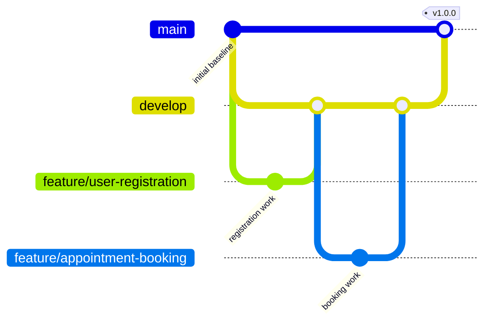

# Task 4 — Git and GitHub Workflow

**Repository:** Physiotherapy Appointment Portal  
**Owner:** Kirti Vispute (23102C0078)  
**Verified remote URL:** [https://github.com/kirti-vispute/physiotherapy-appointment-portal](https://github.com/kirti-vispute/physiotherapy-appointment-portal)  
**Git remote:** `origin`, using the HTTPS `.git` URL.

## Actual local initialization record

**Terminal:** PowerShell. **Location:** Project root. On 2 October 2026, Git 2.53.0 initialized this folder with `main`. The first commit, `4d5536d`, recorded the verified application and Task 1–3 documents. The second, `a9a8762`, added the README, branch policy, and issue/PR templates. A `develop` branch was created from the second commit and checked out. `git status --short --branch` showed `## develop` with no file changes at that point. `git remote -v` produced no URL. These are observed local facts, not GitHub publication evidence.

Git reported a repository ownership difference because the sandbox account created `.git` in Kirti's folder. For local setup commands, a process-scoped `safe.directory` setting was used. The global Git configuration was not changed. This environment detail is not a required step for an ordinary single-user Git installation.

## Branch policy

| Branch | Purpose | Merge rule |
|---|---|---|
| `main` | Verified release baseline | Merge reviewed `develop` only at a release milestone; tag releases here |
| `develop` | Integration branch | Merge reviewed feature PRs after checks pass |
| `feature/<short-name>` | One focused change, e.g. `feature/user-registration` | Branch from `develop`; open PR into `develop`; delete after merge if safe |

Planned feature names include `feature/user-registration`, `feature/appointment-booking`, and `feature/selenium-tests`. A branch name records work; it does not count as a completed feature until code, review, and evidence exist.

The diagram shows the intended branch connections. Task 5 has now demonstrated `feature/user-registration`, three feature/test/docs commits, a COMMENT self-review, and [PR #1](https://github.com/kirti-vispute/physiotherapy-appointment-portal/pull/1) merged into `develop` at `f7713f0`. The booking branch, conflict, and release tag remain Task 6 work. See [actual Task 5 evidence](task-05-registration.md).

## Commit and PR rules

- Use `feat:`, `fix:`, `test:`, `ci:`, `build:`, `docs:`, or `chore:` followed by a specific action. Examples: `feat: add patient registration`, `test: cover appointment cancellation`.
- Keep each commit focused. Check `git status` and the staged diff before committing.
- PRs into `develop` must describe purpose, changed files or behavior, tests actually run, and screenshots when UI changes. Record review comments and resolution.
- Never commit `.env`, the `data/` database, build output, tokens, or real patient data.
- Do not force-push or reset useful commits. Resolve merge conflicts explicitly and record the resolution in Task 6.

## Safe inspection commands

**Terminal:** PowerShell. **Location:** Project root. These read repository state and do not modify it.

| Command | What it does | Expected result | Common error |
|---|---|---|---|
| `git status --short --branch` | Shows current branch and changed files | `## main` or `## develop`, plus any work in progress | `not a git repository` before initialization |
| `git remote -v` | Shows configured remote URLs | `origin` fetch/push URL after GitHub setup | Blank means no remote yet |
| `git log --oneline --decorate -n 8` | Shows recent commits and labels | Meaningful commit messages | Empty before first commit |
| `git branch -a` | Lists local/remote branches | `main`, `develop`, and later feature branches | Remote branches appear only after push/fetch |
| `git tag -l` | Lists release tags | `v1.0.0` after Task 6 | Empty before release |

## GitHub configuration checklist

- [x] Kirti supplied the repository URL; its initial remote had no refs, and the repository was verified under `kirti-vispute`.
- [x] Pushed `main` and `develop` without rewriting history; both now track `origin`.
- [x] Confirmed GitHub shows `README.md`, `.gitignore`, `.github/ISSUE_TEMPLATE`, and screenshots.
- [x] Verified the bug, feature, and pull request template files on GitHub. The issue creation chooser itself requires browser sign-in and was not exercised.
- [x] Captured repository/branch/commit screenshots without credentials.

GitHub branch protection or required review rules will be set only if available for the account and compatible with a single-student project. A self-authored review is not presented as an independent peer review.

## Task 4 evidence instructions

- **Screenshot required?** Yes, once the GitHub repository is published.
- **What should be visible?** GitHub repository name and URL, `README.md`, `.github/ISSUE_TEMPLATE`, two initial commit messages, and both `main` and `develop` branches. Capture the repository page and branch/commit views as needed; do not crop away the repository identity.
- **Command for local proof:** PowerShell at project root: `git status --short --branch`, `git branch -v`, `git log --oneline --decorate -n 3`, and `git remote -v`. These show a clean branch, branch tips, initial commits, and the configured remote. A blank remote output means publication is still pending; a missing branch means it has not been created or pushed.
- **Expected published result:** A verified `origin` URL and both branches visible on GitHub, with no secret, `target/`, or `data/` files committed.
- **Actual evidence files:** `screenshots/T04_repository.jpg`, `screenshots/T04_branches.jpg`, `screenshots/T04_commits.jpg`, and `docs/evidence/T04_git_remote.txt`. The screenshots show the initial publication; later evidence documentation commits are not included in those initial snapshots.
