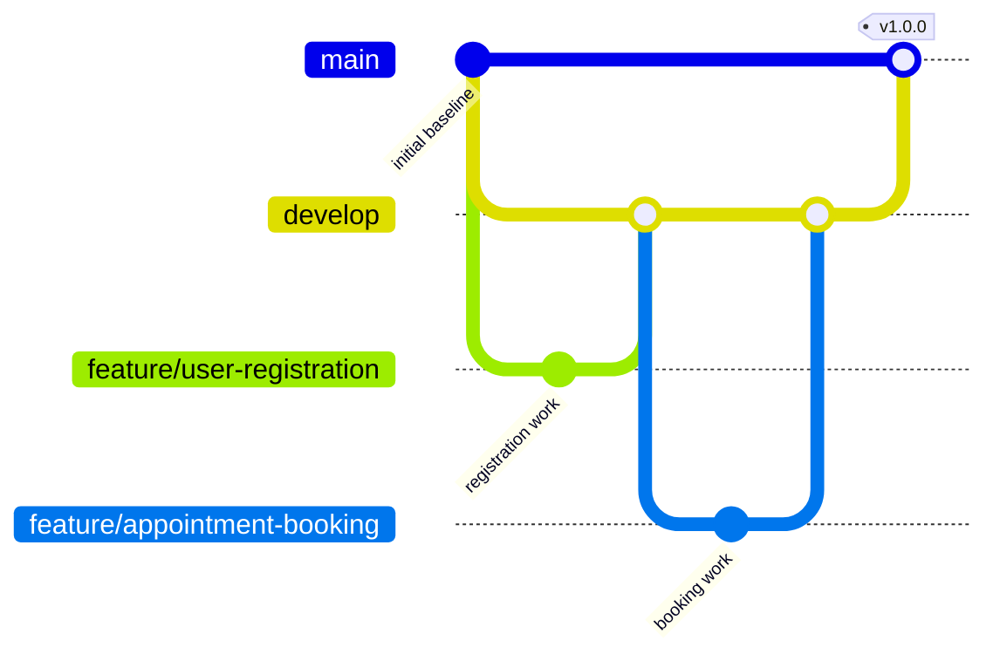

# Task 4 — Git and GitHub Workflow

**Repository:** Physiotherapy Appointment Portal  
**Owner:** Kirti Vispute (23102C0078)  
**Current remote URL:** Pending authenticated GitHub repository creation.

## Branch policy

| Branch | Purpose | Merge rule |
|---|---|---|
| `main` | Verified release baseline | Merge reviewed `develop` only at a release milestone; tag releases here |
| `develop` | Integration branch | Merge reviewed feature PRs after checks pass |
| `feature/<short-name>` | One focused change, e.g. `feature/user-registration` | Branch from `develop`; open PR into `develop`; delete after merge if safe |

Planned feature names include `feature/user-registration`, `feature/appointment-booking`, and `feature/selenium-tests`. A branch name records work; it does not count as a completed feature until code, review, and evidence exist.

The diagram shows the intended branch connections; feature commits, PRs, merges, and tag are not yet claimed as actual history.

## Commit and PR rules

- Use `feat:`, `fix:`, `test:`, `ci:`, `build:`, `docs:`, or `chore:` followed by a specific action. Examples: `feat: add patient registration`, `test: cover appointment cancellation`.
- Keep each commit focused. Check `git status` and the staged diff before committing.
- PRs into `develop` must describe purpose, changed files or behavior, tests actually run, and screenshots when UI changes. Record review comments and resolution.
- Never commit `.env`, the `data/` database, build output, tokens, or real patient data.
- Do not force-push or reset useful commits. Resolve merge conflicts explicitly and record the resolution in Task 6.

## Safe inspection commands

**Terminal:** PowerShell. **Location:** Project root. These read repository state and do not modify it.

| Command | What it does | Expected result | Common error |
|---|---|---|---|
| `git status --short --branch` | Shows current branch and changed files | `## main` or `## develop`, plus any work in progress | `not a git repository` before initialization |
| `git remote -v` | Shows configured remote URLs | `origin` fetch/push URL after GitHub setup | Blank means no remote yet |
| `git log --oneline --decorate -n 8` | Shows recent commits and labels | Meaningful commit messages | Empty before first commit |
| `git branch -a` | Lists local/remote branches | `main`, `develop`, and later feature branches | Remote branches appear only after push/fetch |
| `git tag -l` | Lists release tags | `v1.0.0` after Task 6 | Empty before release |

## GitHub configuration checklist

- [ ] Create repository under Kirti's GitHub account and record its verified URL.
- [ ] Push `main` and `develop` without rewriting history.
- [ ] Confirm the repository shows `README.md`, `.gitignore`, `.github/ISSUE_TEMPLATE`, and screenshots.
- [ ] Confirm the issue templates and pull request template appear in GitHub.
- [ ] Capture repository/branch/commit evidence without exposing credentials.

GitHub branch protection or required review rules will be set only if available for the account and compatible with a single-student project. A self-authored review is not presented as an independent peer review.
