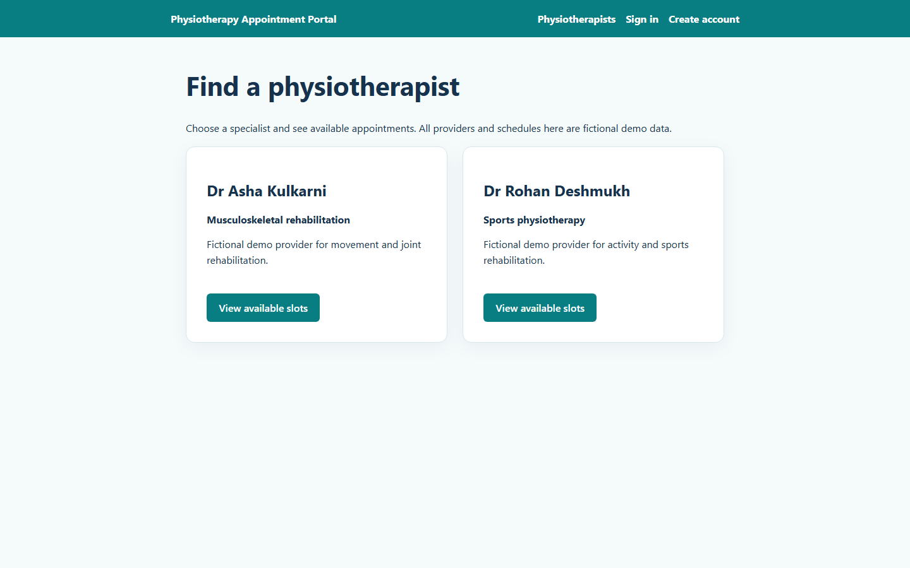

# Task 12 — Jenkins and Docker continuous deployment

**Owner:** Kirti Vispute (23102C0078)

**Date:** 3 October 2026

**Status:** ✅ Complete — feature build #8 and merged `develop` build #9 verified

## Deployment path

The versioned [Jenkinsfile](../Jenkinsfile) now runs Checkout → Build → Unit Test → Package → Start Application → Selenium Tests → Publish Test Report → Docker Build → Docker Tag → Docker Push → Stop Previous Container → Run New Container → Health Check. The five Selenium journeys use the isolated temporary app on 8091. A failure before Docker Build skips image publication and deployment.

The [Docker CD helper](../scripts/docker-cd.ps1) creates the tag `1.0.0-b<build number>-<first 12 commit characters>`, builds the tested JAR, tags and pushes it to `localhost:5000/physio-portal`, pulls that registry tag, and runs `physio-portal-cd-<APP_ENV>`. It checks ownership labels before replacing a prior container. The final health stage requires `/actuator/health` status `UP`, HTTP 200 from the home and provider pages, and a container label matching the checked-out Git commit. It archives per-stage logs and `target/docker-deployment.json`.

The local registry is allowed by the assignment. Docker Hub was signed in for the interactive Windows user, but Jenkins runs as `LocalSystem`, which does not have that user's Docker Hub credential. The local registry avoids copying a personal token into Jenkins. It binds only `127.0.0.1:5000` and stores data in named volume `physio-registry-data`. The Jenkins container binds `127.0.0.1:8087` → `8080/tcp` for the `test` profile and uses `physio-portal-cd-test-data` for H2 persistence. Port 8088 is the alternate parameter choice. The existing Task 11 container on 8086 is separate.

## Setup and reproduction

**Terminal:** PowerShell at the project root on the Jenkins/Docker Desktop Windows host. Docker Desktop's Linux engine, Java 21, Maven, Chrome, and the existing Jenkins job are required. The registry was started once with:

```powershell
docker volume create physio-registry-data
docker run -d --name physio-local-registry --restart unless-stopped -p 127.0.0.1:5000:5000 --mount type=volume,source=physio-registry-data,target=/var/lib/registry registry:2
Invoke-WebRequest http://127.0.0.1:5000/v2/ -UseBasicParsing
```

**Observed:** registry container `8d241fb9f870…` was `Up`, mapped `127.0.0.1:5000->5000/tcp`, and `/v2/` returned HTTP 200. The `registry:2` image is a service prerequisite; the application image has its own versioned tag.

**Jenkins:** the `physio-portal-pipeline` job reads `Jenkinsfile` from the GitHub branch configured in its SCM settings. Choose **Build with Parameters**, `APP_ENV=test`, `DOCKER_PORT=8087`. On the first feature build, Jenkins still had the old Task 8 `PORT` parameter until the new Jenkinsfile updated the job; the helper defaulted to 8087. Subsequent builds use `DOCKER_PORT`. Expected after a passing test gate: a versioned registry push, fresh container, archived Docker logs, deployment JSON, and health `UP`. If Docker Desktop cannot start, see the [Task 11 socket recovery](task-11-docker.md). If port 8087 is occupied by another service, the helper stops before creating a new container.

The pipeline's Windows PowerShell helper points the Docker CLI at the Desktop Linux named pipe. It writes a credential-free Docker CLI config under ignored `target/docker-cli` to locate the installed Buildx plugin for Jenkins' `LocalSystem` account. The registry is loopback HTTP, so manifest inspection uses Docker's explicit `--insecure` flag; no public HTTP registry or Docker Hub credential was configured.

## First feature run and correction

[Build #7](http://localhost:8080/job/physio-portal-pipeline/7/) checked out `27a7d18e9368ff365359c0a9210d46ab291cf992` and passed 34 backend plus five Selenium tests. Docker Build then failed before creating an image because Windows PowerShell treated Docker's legacy-builder warning on stderr as a terminating error. Docker Tag, Push, Stop, Run and Health were skipped. The [actual failed console](evidence/T12_console_build7_failed.txt) records the boundary; no successful deployment is claimed for #7.

Commit `45a75f6` handles Docker stderr by checking the native exit code and supplies a credential-free Buildx plugin directory. Local Windows PowerShell preflight then reported Docker server 29.7.2, Linux engine, Buildx v0.36.1, and registry HTTP 200. A separate versioned registry preflight push/pull proved loopback connectivity. Docker manifest inspection required `--insecure`, corrected in commit `7abc4c2fbe539e1dbfa8f5d4f759734b570dbedf`.

## Successful feature run — build #8

[Jenkins build #8](http://localhost:8080/job/physio-portal-pipeline/8/) checked out exact feature commit `7abc4c2fbe539e1dbfa8f5d4f759734b570dbedf`. Jenkins reported **39 passes, zero failures/skips**: 34 backend and five Selenium. The [console](evidence/T12_console_build8_success.txt) shows every named stage in order and `SUCCESS`. Jenkins archived its JAR, Selenium report, six Docker stage logs, and deployment JSON.

| Field | Observed value |
|---|---|
| Registry image | `localhost:5000/physio-portal:1.0.0-b8-7abc4c2fbe53` |
| Registry digest / image ID | `sha256:99d581fdce45bbd845698c0e104c949e8991c787d013d9bc6347b42923ed054a` |
| Container | `physio-portal-cd-test`, ID `618b9216e9346bac9a3da3a8c4c637697d4c159b7fb89fa367ba69c3938487bf` |
| Mapping | Host `127.0.0.1:8087` → container `8080/tcp` |
| Commit label | `7abc4c2fbe539e1dbfa8f5d4f759734b570dbedf` |
| Health/pages | `UP`; home HTTP 200; providers HTTP 200 |
| Artifact identity | Jenkins JAR and `/app/app.jar` SHA256 both `aff57477aa87a3c3ba2449feedda9ef966fe1f3327f1238dba7fdadee0ebe818` |

The [independent check](evidence/T12_independent_build8.json) compares registry tag, image ID, running container labels, port, live HTTP responses, and JAR hash. The [push log](evidence/T12_build8_docker-push.log) shows the real registry digest; [deployment metadata](evidence/T12_build8_deployment.json) identifies the commit and container. Also retained: [Jenkins API result](evidence/T12_build8_api.json), [test count](evidence/T12_build8_tests.json), [build](evidence/T12_build8_docker-build.log), [tag](evidence/T12_build8_docker-tag.log), [stop](evidence/T12_build8_docker-stop.log), [run](evidence/T12_build8_docker-run.log), [health/logs](evidence/T12_build8_docker-health.log), and [feature job configuration](evidence/T12_job_feature.xml).

## Screenshot



**Screenshot required?** Yes. **What is visible?** The real providers page served by the Task 12 container at the mapped 8087 host port, with two fictional providers. It is a headless Chrome capture of the live site, not a Docker or Jenkins UI screenshot. The command log and JSON evidence above prove the Jenkins build, registry push, IDs, and mapping. **Command location/type:** PowerShell at project root, Chrome headless with `--window-size=1440,900`, `--screenshot=<project>/screenshots/T12_docker_deployment.png`, and URL `http://127.0.0.1:8087/physiotherapists`. **Expected and actual result:** the healthy portal page. **Suggested filename used:** `T12_docker_deployment.png`.

## Reviewed merge and final `develop` deployment

[PR #7](https://github.com/kirti-vispute/physiotherapy-appointment-portal/pull/7) received an honest [COMMENT self-review](https://github.com/kirti-vispute/physiotherapy-appointment-portal/pull/7#pullrequestreview-5400448994) and was merged at `180b726bc020aaa534f65f69283f30b9bb04abeb`. This was a single-contributor review, not independent approval. Jenkins SCM was restored to `*/develop`; the [saved job configuration](evidence/T12_job_develop.xml) records it.

[Jenkins build #9](http://localhost:8080/job/physio-portal-pipeline/9/) checked out that exact merge commit. Its [console](evidence/T12_console_build9_success.txt) shows all stages in order and `SUCCESS`; the [test result](evidence/T12_build9_tests.json) records **39 passes, zero failures, zero skips**. The versioned registry image was pushed before Jenkins stopped and removed build #8's owned container, then pulled and ran a new container. This is the observed commit → passing tests → registry → fresh container path, without a manual application `docker run` between the Jenkins stages.

| Field | Observed final value |
|---|---|
| Registry image | `localhost:5000/physio-portal:1.0.0-b9-180b726bc020` |
| Registry digest / image ID | `sha256:3977b8ccbc1706b2eb00425f4589ad0a720752d492c02b4f37ea410b63d5f9e5` |
| New container | `physio-portal-cd-test`, ID `692075d7910a1de97cf251331e3cd549019972bec26e1fa867fbf248532e472b` |
| Previous container | Build #8 ID `618b9216e9346bac9a3da3a8c4c637697d4c159b7fb89fa367ba69c3938487bf`, stopped and removed |
| Network and data | Host `127.0.0.1:8087` → container `8080/tcp`; volume `physio-portal-cd-test-data` reused |
| Source label | `180b726bc020aaa534f65f69283f30b9bb04abeb` |
| Health/pages | `UP`; home HTTP 200; providers HTTP 200 |
| Artifact identity | Jenkins JAR and `/app/app.jar` SHA256 both `f856abda697babe7851295e108b62b892839ef1251a6b253380cb0a96eb9ecc5` |

The [before state](evidence/T12_before_replacement.json) identifies the healthy old container. The [stop log](evidence/T12_build9_docker-stop.log) shows its ownership labels, `docker stop`, and `docker rm`. The [independent after check](evidence/T12_independent_build9.json) verifies the old ID is absent, the new ID is running with the merge commit label, the versioned registry tag/digest exists, and the live pages, health, port, volume and JAR match the Jenkins archive. The actual [push log](evidence/T12_build9_docker-push.log), [deployment metadata](evidence/T12_build9_deployment.json), [Jenkins API result](evidence/T12_build9_api.json), and [build](evidence/T12_build9_docker-build.log), [tag](evidence/T12_build9_docker-tag.log), [run](evidence/T12_build9_docker-run.log), and [health/logs](evidence/T12_build9_docker-health.log) complete the per-stage record.

The screenshot above was captured during feature build #8 and shows the real app served on 8087. The build #9 console and archived records establish the final replacement and image identity. A deliberately failed health check was not run in Task 12; the helper fails the pipeline when its health checks do not pass. Bad-release recovery belongs to Task 14.
