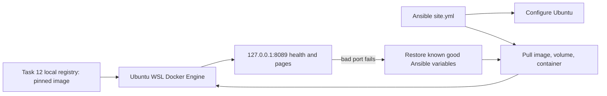
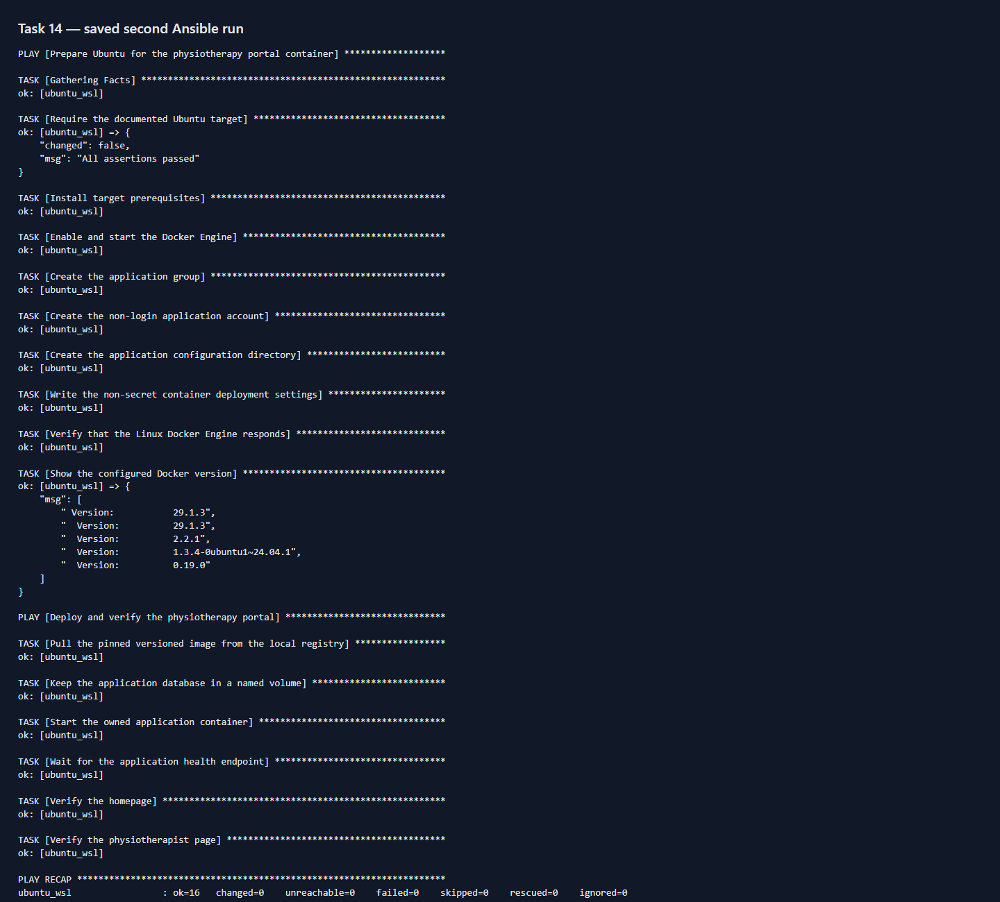
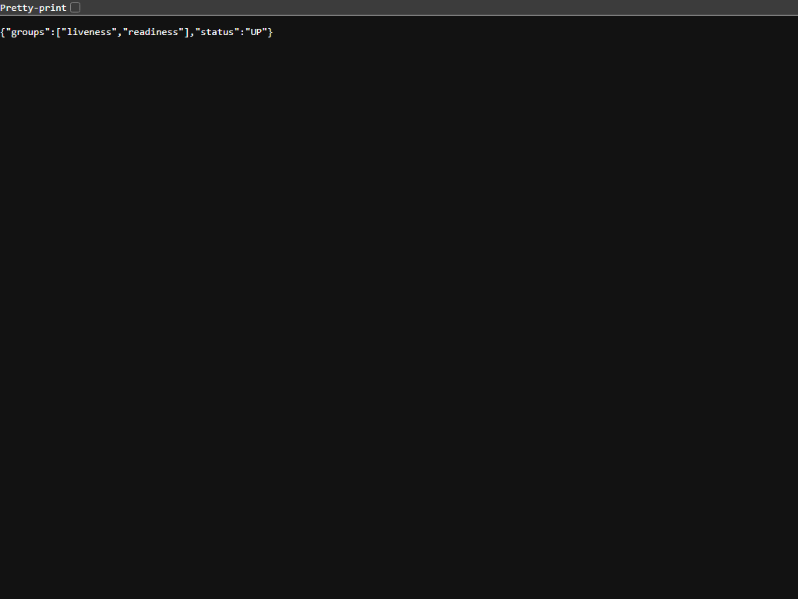
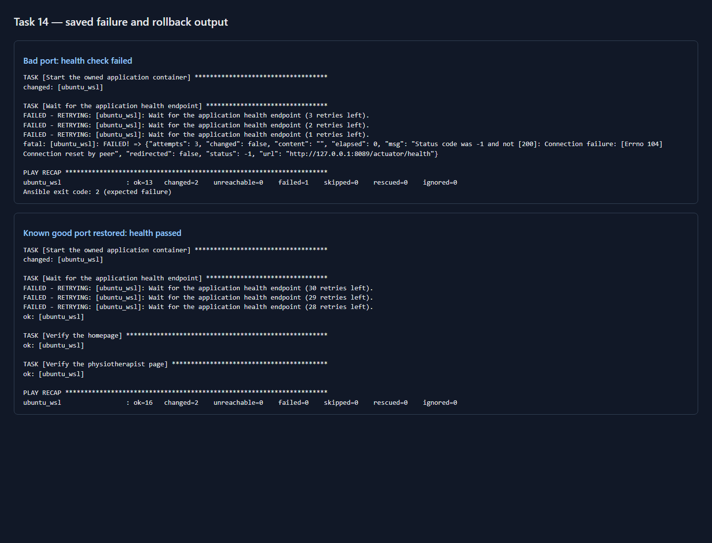

# Task 14 — Ansible provisioning, health and rollback

**Owner:** Kirti Vispute (23102C0078)

**Date:** 3 October 2026

**Status:** ✅ First and second runs, bad configuration and recovery verified on the local Ubuntu WSL target

## Objective and architecture

Task 13 configured a fresh Ubuntu 24.04 WSL machine. Before this task's deployment, the Ubuntu Docker Engine had **no application image or container**; the [before record](evidence/T14_before_provisioning.json) confirms both absent while the Task 12 local registry returned HTTP 200. Task 14's [site playbook](../ansible/site.yml) imports the Task 13 machine configuration and the new [deployment playbook](../ansible/deploy.yml). Everything runs on the user's computer with Ubuntu WSL, its Docker Engine, Ansible, and the existing loopback registry; no paid cloud service is involved.

The deployment playbook pulls the pinned `localhost:5000/physio-portal:1.0.0-b9-180b726bc020` image, creates named volume `physio-portal-ansible-data`, starts owned container `physio-portal-ansible`, binds `127.0.0.1:8089` to container port `8080`, and requires `/actuator/health` status `UP` plus HTTP 200 from the home and provider pages. The image's embedded Java 21 and Spring Boot Tomcat server run the application; no external Tomcat or Nginx is installed.



**Port:** Windows/WSL host `127.0.0.1:8089` → container `8080`. **Data:** `/app/data` is backed by the named Docker volume. **Identity:** the image runs as UID 10001, matching the Task 13 `physio` service account. The application image is fixed to a full version tag; `latest` is not used as the release identifier.

## Local WSL lifetime prerequisite

The Ubuntu Docker Engine is separate from Docker Desktop. During the first check after provisioning, the short WSL command exited and Ubuntu shut down, causing Docker and the container to stop. The initial Ansible run had passed while its WSL session was active, but a later Windows request was reset. The [startup helper](../scripts/start-ansible-target.ps1) starts one hidden, idle `wsl.exe ... sleep infinity` process to keep the target active during the local demo. After starting it, Windows reached the portal and the independent [healthy state](evidence/T14_good_before_failure.json) was saved. This helper uses no paid service and can be run again after a Windows restart; it detects its own existing process.

**Terminal:** Windows PowerShell at the project root.

```powershell
powershell -NoProfile -ExecutionPolicy Bypass -File scripts/start-ansible-target.ps1
```

**Expected and actual:** `Ubuntu WSL keeper started (PID ...)` or `already running`; the recovered app stayed reachable from Windows. If WSL or Docker is stopped, start the helper, then check `wsl -d Ubuntu-24.04 -u root -- systemctl is-active docker`. The PID is stored only in ignored `target/ansible-wsl-keeper.pid`. Windows reboot ends this local demo session; rerun the helper and playbook for a demonstration.

## What the deployment tasks do

| Task | Desired state and verification |
|---|---|
| Pull pinned image | The exact Task 12 registry tag is present in the Ubuntu engine. An existing matching image reports `ok`. |
| Keep database volume | The named volume exists and survives container replacement. |
| Start owned container | Ansible manages only `physio-portal-ansible`, with `managed-by=ansible` label, pinned image, profile, port and volume. A matching container remains unchanged on a second run. |
| Wait for health | Retry `/actuator/health` until HTTP 200 and JSON status `UP`, then fail the playbook if it never recovers. |
| Verify pages | Require HTTP 200 from `/` and `/physiotherapists`. |

The Task 13 [inventory, variables, template and machine tasks](../ansible/README.md) remain part of `site.yml`, covering machine preparation, packages, folder and environment file. `portal_application_port` is normally `8080`; the deliberate bad release overrides only this setting. The playbook uses Ansible modules and Docker's local API rather than unconditional `docker run` commands, which makes the second run idempotent.

## First provisioning and second-run idempotency

**Terminal:** Windows PowerShell at the project root. Ubuntu WSL, Ansible and the local registry must be running. Keep quotation marks around the WSL path because the workspace contains spaces. Run the helper above before these commands.

```powershell
$linuxProject = '/mnt/d/Kirti/__VIT RELATED/Lab Experiments/DEVOPS/DevOps Project'
wsl -d Ubuntu-24.04 -u root -- ansible-playbook --syntax-check -i "$linuxProject/ansible/inventory.ini" "$linuxProject/ansible/site.yml"
wsl -d Ubuntu-24.04 -u root -- ansible-playbook -i "$linuxProject/ansible/inventory.ini" "$linuxProject/ansible/site.yml"
wsl -d Ubuntu-24.04 -u root -- ansible-playbook -i "$linuxProject/ansible/inventory.ini" "$linuxProject/ansible/site.yml"
```

**Expected:** syntax check names `site.yml`; the first full run pulls, creates and starts the container with `failed=0`; the second run reports `changed=0 failed=0`. **Actual:** [first run](evidence/T14_provision_first.txt) `ok=16 changed=4 failed=0` (environment file, image, volume and container); [second run](evidence/T14_provision_second.txt) `ok=16 changed=0 failed=0`. The first health check retried three times while Spring Boot started, then passed. The second run did not recreate the container or volume.

If image pull fails, confirm `http://127.0.0.1:5000/v2/` responds in Ubuntu and the pinned tag exists. If Ansible says the Docker socket is unavailable, check `systemctl is-active docker` in Ubuntu. If port 8089 is taken, choose a free `portal_host_port` in the group variables and rerun; do not stop another service blindly.

## Health check and bad release

**Terminal:** Windows PowerShell at the project root. This checks the deployed app from the Windows side after the helper is running.

```powershell
Invoke-RestMethod http://127.0.0.1:8089/actuator/health
(Invoke-WebRequest http://127.0.0.1:8089/ -UseBasicParsing).StatusCode
(Invoke-WebRequest http://127.0.0.1:8089/physiotherapists -UseBasicParsing).StatusCode
```

**Expected and actual before failure:** `status: UP`, then `200`, `200`. The [healthy state](evidence/T14_good_before_failure.json) records container `35ce9cc9dd2f774d87f5aa41491d64318718b263a745ba59f41c340d229faccb`, image ID `sha256:3977b8ccbc1706b2eb00425f4589ad0a720752d492c02b4f37ea410b63d5f9e5`, and the named volume.

The assignment permits a simulated bad release. Here the candidate changes `PORT` inside the app to **8099**, while Docker still publishes host 8089 to container **8080**. Ansible replaces the container, then its real health gate fails. The image bytes remain the known good version; the failure is an intentional deployment configuration defect, not a new application binary. Use short retry settings for this one demonstration:

```powershell
wsl -d Ubuntu-24.04 -u root -- ansible-playbook -i "$linuxProject/ansible/inventory.ini" "$linuxProject/ansible/site.yml" -e portal_application_port=8099 -e portal_health_retries=3 -e portal_health_delay=2
```

**Expected and actual:** Ansible exits **2**, with `failed=1` at `Wait for the application health endpoint`; see the [failed run](evidence/T14_bad_release.txt). The [bad-state check](evidence/T14_bad_release_state.json) shows a different container ID `aeb872bb5cae9ef21886867ea7a24430fdc68e80c001bb8850e5634ff8583978`, `PORT=8099`, failed host health, but direct container health HTTP 200 on 8099. The image ID and named volume match the earlier good state. This isolates the failure to the port mismatch and protects the known good image and H2 data. Do not use this override during normal operation.

## Rollback and recovered health

**Terminal:** Windows PowerShell at the project root. Reapply the versioned, known good settings without the bad override:

```powershell
wsl -d Ubuntu-24.04 -u root -- ansible-playbook -i "$linuxProject/ansible/inventory.ini" "$linuxProject/ansible/site.yml"
Invoke-RestMethod http://127.0.0.1:8089/actuator/health
```

**Expected and actual:** [rollback run](evidence/T14_rollback.txt) `ok=16 changed=2 failed=0`; Ansible restored the environment file and replaced the bad container, then health and both pages passed. The [independent recovery check](evidence/T14_recovered_state.json) records new container `e10fff6ab63f7f84e50bbc3a8077624858f018e2d068b757a4bdff785ae10a56`, `PORT=8080`, known good image ID, removal of the bad container, preserved volume and database file, health `UP`, and HTTP 200 for health/home/providers. If recovery fails, inspect `wsl -d Ubuntu-24.04 -u root -- docker logs --tail 80 physio-portal-ansible` and the Ansible failure before changing the image or volume.

## Screenshots and evidence checklist







| Screenshot | Required visible result | Source and exact reproduction action |
|---|---|---|
| `T14_ansible_idempotency.png` | Second-run `PLAY RECAP` shows `changed=0 failed=0` | Browser rendering of the actual saved [second log](evidence/T14_provision_second.txt); run the second `ansible-playbook` command above in a visible terminal for a terminal capture. |
| `T14_health_check.png` | Live endpoint JSON includes `"status":"UP"` | Headless Chrome opened `http://127.0.0.1:8089/actuator/health` after recovery; verify HTTP 200 with the PowerShell command above. |
| `T14_rollback.png` | Bad run `failed=1`, then rollback `failed=0` and health task `ok` | Browser rendering of excerpts from the actual [bad](evidence/T14_bad_release.txt) and [rollback](evidence/T14_rollback.txt) logs; both full files are retained. |

These are real run records. The two log screenshots are readable renderings of saved output, not claims of a live terminal screenshot. The [before state](evidence/T14_before_provisioning.json), [good state](evidence/T14_good_before_failure.json), [bad state](evidence/T14_bad_release_state.json), and [recovered state](evidence/T14_recovered_state.json) link the actual image/container/volume IDs and HTTP results.

## Task 14 checklist

- ✅ Ubuntu target prepared, required packages installed, folder/account and environment configured
- ✅ Versioned image pulled from the local registry; volume and application container started by Ansible
- ✅ First full run `changed=4 failed=0`; second run `changed=0 failed=0`
- ✅ Health `UP` and HTTP 200 demonstrated from Windows after WSL keeper started
- ✅ Intentional bad port produced a real Ansible health failure; image and data volume remained intact
- ✅ Known good configuration reapplied; bad container removed and health/home/providers returned HTTP 200
- ✅ Actual logs, state checks and screenshots saved
